# Arqh Mission Control -- Logistics Dispatch Platform

> A senior-grade, full-stack logistics dispatch prototype built as a **Bun monorepo** with end-to-end type safety, Redis-first state management, event-driven optimization, and real-time SSE updates.

```
┌─────────────┐       ┌──────────────┐       ┌──────────────┐
│  React SPA  │──────▶│  Express API │──────▶│    Redis     │
│  (Vite/TS)  │◀──SSE─│  (Bun)       │◀──────│  (hot state) │
└─────────────┘       └──────┬───────┘       └──────┬───────┘
                             │                      │
                      ┌──────▼───────┐       ┌──────▼───────┐
                      │   MongoDB    │       │ Redis Streams │
                      │ (durable)    │       │ events/results│
                      └──────────────┘       └──────┬───────┘
                                             ┌──────▼───────┐
                                             │    Worker     │
                                             │ (optimizer)   │
                                             └──────────────┘
```

## Monorepo Structure

```
/
├── packages/
│   ├── shared/              @repo/shared -- Zod schemas & inferred types
│   └── monitoring/          Grafana/Prometheus/Loki/Promtail assets
│       ├── grafana/provisioning/   Compose-mounted datasources + dashboards
│       └── grafana/k8s/            K8s-only datasource URLs (not mounted by Compose)
├── apps/
│   ├── api/                 Express API + Redis Lua scripts + Worker
│   └── web/                 React + Vite + Zustand + TanStack Query
├── infra/
│   ├── kind/                Multi-node kind cluster config
│   └── helm/
│       ├── arqh-platform/   App chart (api/worker/web/redis/mongo/ingress/HPA)
│       └── monitoring/      Observability chart (kube-prometheus-stack + Loki + Promtail)
├── tests/infra/             pytest cluster-state + Ingress smoke + monitoring tests
├── .github/workflows/       CI quality gates + GHCR image publish
├── run-platform.sh          Bootstrap control script (K8s default, compose-* fallback)
├── Makefile                 Thin wrapper (`make bootstrap`, `make smoke`, …)
├── docker-compose.yml       Fallback app + monitoring stack (no Kubernetes)
├── docker-compose.monitoring.yml  Optional prod-style monitoring overlay
└── package.json             Bun workspace config
```

### Why a Monorepo?

The task specification explicitly requires **shared type definitions** between frontend and backend. A monorepo with a `packages/shared` workspace is the only clean way to achieve this without code duplication:

- **`@repo/shared`** exports Zod schemas that are the _single source of truth_ for all domain types (`Vehicle`, `Order`, `Solution`, `Assignment`) and API contracts.
- If a schema changes, both `apps/api` and `apps/web` see the update immediately -- or fail to compile. This is real end-to-end type safety.
- No copy-paste of `types.ts` between repos. No codegen. No drift.

## Running on Kubernetes (Pillar A — submission target)

The submission target is a local **multi-node Kubernetes** topology, packaged as a single Helm
chart and fronted by an Ingress. `make bootstrap` (alias for `./run-platform.sh up`) brings the
whole platform up green with one command. The Docker Compose stack in [Quick Start](#quick-start)
is retained only as a no-Kubernetes fallback (`make compose-up`).

### Prerequisites

| Tool    | Version used | Purpose                                                |
| ------- | ------------ | ------------------------------------------------------ |
| Docker  | 27.x         | Build images + run the kind nodes                      |
| kind    | 0.23+        | Local multi-node cluster (1 control-plane + 2 workers) |
| kubectl | 1.30+        | Cluster access                                         |
| Helm    | 3.15+ / 4.x  | Chart packaging + install                              |
| Python  | 3.11+        | Infra test venv (auto-created at `.tmp/infra-venv`)    |
| openssl | any          | Self-signed TLS cert for the Ingress                   |

Windows: run under WSL2 or Git Bash.

### One command to green

```bash
make bootstrap        # preflight -> kind cluster -> deps -> deploy -> infra smoke
```

This runs the stages in [`run-platform.sh`](run-platform.sh):

1. **cluster** — `kind create cluster` from [`infra/kind/kind-cluster.yaml`](infra/kind/kind-cluster.yaml) (ports 80/443 mapped).
2. **deps** — installs `metrics-server` (patched `--kubelet-insecure-tls`), `ingress-nginx`, the
   monitoring stack (`kube-prometheus-stack` + Loki + Promtail), and self-signed TLS secrets for the
   app + Grafana hosts.
3. **deploy** — builds `arqh-api|worker|web:local`, `kind load`s them, and `helm upgrade --install arqh infra/helm/arqh-platform -n arqh`.
4. **smoke** — waits for Ingress health, then runs `pytest tests/infra` from an isolated venv.

**Green** means: all pods Ready, `kubectl get hpa` shows real (non-`<unknown>`) metrics, and
`curl -k https://arqh.localtest.me/api/health` returns `200` with Redis + Mongo `connected`.
Grafana is at `https://grafana.arqh.localtest.me` (admin creds under `.tmp/k8s/grafana-admin.env`).

### Traffic flow

```
Browser ──HTTPS──▶ ingress-nginx ─┬─ /api/*  ─▶ arqh-api  (ClusterIP :4000) ─▶ Redis + Mongo
                                  └─ /        ─▶ arqh-web  (ClusterIP :8080, nginx-unprivileged + SPA)
/metrics is served on the API root only and is NOT routed by the Ingress (stays internal).
```

### Operations

- **Scaling (HPA):** `kubectl get hpa -n arqh` — API scales on CPU 70% / memory 80% (min 2, max 5).
- **Resilience:** API PDB (`minAvailable: 1`) + soft anti-affinity; NetworkPolicies lock Redis/Mongo to api/worker.
- **Rolling update:** rebuild + `kind load`, then `helm upgrade arqh infra/helm/arqh-platform -n arqh`.
- **Inspect probes:** `kubectl describe deploy arqh-api -n arqh` — readiness `/api/health` (dependency-aware),
  liveness/startup `/api/live` (dependency-free, so a Redis blip never triggers a restart loop).
- **Status / logs:** `make ps` · `make logs ARGS=api` (also `grafana`, `prometheus`, `loki`).

### Telemetry coordinates

| Item               | Value                                                                                                        |
| ------------------ | ------------------------------------------------------------------------------------------------------------ |
| App UI (K8s)       | `https://arqh.localtest.me` — **not** `localhost:5173`                                                       |
| Grafana (K8s)      | `https://grafana.arqh.localtest.me` — **not** `localhost:3001`                                               |
| Admin creds        | `.tmp/k8s/grafana-admin.env` (`admin-user` / `admin-password`)                                               |
| Dashboards         | **Arqh API Overview** · **Arqh Platform Observability** (folder `Arqh`)                                      |
| Prometheus         | ClusterIP only — ServiceMonitor `arqh-api` scrapes `/metrics`                                                |
| Useful PromQL      | `up{job="arqh-api"}` · `arqh_dependency_up` · `rate(http_request_duration_ms_count{status_code=~"5.."}[5m])` |
| Useful LogQL       | `{app="arqh-api"} \| json \| level="error"`                                                                  |
| Optional localhost | `kubectl -n monitoring port-forward svc/monitoring-grafana 3000:80` → `http://localhost:3000`                |

> `localhost:5173` / `localhost:3001` only apply after `make compose-up`. The submission path is Kubernetes.

### How to check monitoring (operator walkthrough)

1. **Bring the platform up** (if it is not already green):

   ```bash
   make bootstrap
   ```

2. **Confirm monitoring pods are Ready**:

   ```bash
   make ps
   # or
   kubectl get pods -n monitoring
   kubectl get pods -n arqh
   ```

3. **Read Grafana admin credentials** (generated once, reused on later boots):

   ```bash
   cat .tmp/k8s/grafana-admin.env
   # admin-user=admin
   # admin-password=...
   ```

4. **Open Grafana in the browser**:
   - URL: [https://grafana.arqh.localtest.me](https://grafana.arqh.localtest.me)
   - Accept the self-signed certificate warning
   - Sign in with the values from `.tmp/k8s/grafana-admin.env`

5. **Open the provisioned dashboards** (Dashboards → Browse → folder **Arqh**):

   | Dashboard                       | What to verify                                                                                                                 |
   | ------------------------------- | ------------------------------------------------------------------------------------------------------------------------------ |
   | **Arqh API Overview**           | Request heatmap, request count by route, 4xx/5xx rates, process CPU/mem, API logs                                              |
   | **Arqh Platform Observability** | Pod restarts, error-log spikes, API 5xx by route, capacity vs requests/limits, Redis/Mongo dependency latency, request heatmap |

6. **Generate a little traffic** so panels are not empty:

   ```bash
   curl -sk https://arqh.localtest.me/api/health
   curl -sk https://arqh.localtest.me/api/state
   # optional: open the app UI and click around
   open https://arqh.localtest.me
   ```

   Wait ~15–30s (Prometheus scrape interval), then refresh the dashboard (time range: **Last 15 minutes**).

7. **Quick signals that mean "healthy"**:
   - Explore → Prometheus → query `up{job="arqh-api"}` → value `1`
   - Explore → Prometheus → `arqh_dependency_up` → `redis` and `mongo` are `1`
   - Explore → Loki → `{app="arqh-api"} | json` → recent log lines appear
   - Platform Observability → **Dependency Latency** shows Redis/Mongo lines after health probes

8. **If something is blank**:
   - No metrics: `kubectl get servicemonitor -n monitoring` and `make smoke` (includes scrape checks)
   - No logs: wait for Promtail, then confirm labels with `{app="arqh-api"}`
   - Cannot reach Grafana: `kubectl get ingress -n monitoring` and `make logs ARGS=grafana`
   - Wrong password: re-read `.tmp/k8s/grafana-admin.env` (do not recreate casually — it is the source of truth for the Secret)

### Testing

```bash
make smoke            # wait for Ingress health, then pytest tests/infra -v (venv auto-managed)
# or directly:
INGRESS_HOST=arqh.localtest.me GRAFANA_HOST=grafana.arqh.localtest.me \
KUBECONFIG=~/.kube/config \
  .tmp/infra-venv/bin/python -m pytest tests/infra -v
```

- `tests/infra/test_cluster_state.py` — Ready workloads, probes, resources, secrets, HPA, PDB, NetworkPolicies, Ingress.
- `tests/infra/test_smoke_e2e.py` — health, hydration, assign round-trip, optimize pipeline, SSE, `/metrics` non-exposure.
- `tests/infra/test_zz_probe_resilience.py` — deleting a Redis pod degrades readiness (not liveness) and recovers (runs last).
- `tests/infra/test_monitoring.py` — monitoring workloads Ready, ServiceMonitor, Grafana ingress, Prometheus scrapes `arqh-api`.

### Teardown

```bash
make down             # uninstall monitoring + app releases, then kind delete cluster
```

## Quick Start

### Option 1: Docker Compose (fallback / no-Kubernetes)

Prefer the Makefile wrappers so teardown stays consistent:

```bash
cp .env.docker.example .env.docker
make compose-up          # or: ./run-platform.sh compose-up
make compose-down ARGS=-v
```

| Service | URL                   | Purpose               |
| ------- | --------------------- | --------------------- |
| Web UI  | http://localhost:5173 | Dispatch dashboard    |
| API     | http://localhost:4000 | Express API           |
| Grafana | http://localhost:3001 | Compose monitoring UI |

Do **not** mix these with the Kubernetes URLs while both stacks are running — tear one down first (`make compose-down` or `make down`).

### Option 2: Local Development

```bash
# Prerequisites: Bun >= 1.0, Redis >= 7, MongoDB >= 6

# Install all workspace dependencies from root
bun install

# Copy and configure environment
cp .env.example .env
# Edit .env with your local Redis/MongoDB connection details

# Start the API server (hot reload)
bun run dev:api

# Start the optimization worker (separate terminal)
bun run dev:worker

# Start the frontend dev server (separate terminal)
bun run dev:web
```

### Environment Files

| File          | Used by                                                | Notes                                                                              |
| ------------- | ------------------------------------------------------ | ---------------------------------------------------------------------------------- |
| `.env`        | Local development and production runtime               | For production, inject real values through deployment secrets or host env vars.    |
| `.env.docker` | `docker-compose.yml` services (`api`, `worker`, `web`) | Copy from `.env.docker.example`; uses Docker service hostnames (`redis`, `mongo`). |
| `.env.test`   | `bun run test` (API integration tests)                 | Loaded automatically by `apps/api/package.json` via `--env-file=../../.env.test`.  |

### Running Tests

```bash
# Run the full API integration test suite (uses .env.test automatically)
bun run test


# Or directly from the API workspace
cd apps/api && bun run test
```

### Running Performance Benchmarks (p95/p99 + Throughput)

```bash
# Start the stack first
docker compose up --build

# Run benchmark suite and generate JSON + Markdown reports
bun apps/api/perf/run.ts

# (optional npm-style alias)
bun run perf:report

# Generate visual dashboard from JSON reports
bun run perf:viz

# Run benchmark + dashboard generation together
bun run perf:all
```

Benchmark reports are generated in:

- `apps/api/perf/reports/perf-<timestamp>.json`
- `apps/api/perf/reports/perf-<timestamp>.md`

The benchmark covers:

- `GET /api/state` hot-cache read latency
- `POST /api/assign` Redis-first mutation latency
- `POST /api/optimize` queue latency (`202 Accepted`)
- Optimization end-to-end latency (API -> stream -> worker -> Redis update)

For detailed knobs and run protocol, see:

- `apps/api/perf/README.md`

Note: development rate limits can dominate this benchmark and produce `429`-heavy reports. Use relaxed rate-limit env values for capacity measurements.

## Architecture Overview

Platform topology, Ingress, probes, data flows, observability, bootstrap, Helm, CI/CD, and infra tests:

App deep dives: [`apps/api/README.md`](apps/api/README.md) · [`apps/web/README.md`](apps/web/README.md)

### Platform topology (kind)

Runtime view after `make bootstrap` (cluster create / Helm / smoke are in [Bootstrap lifecycle](#bootstrap-lifecycle) below — not shown as dangling edges here).

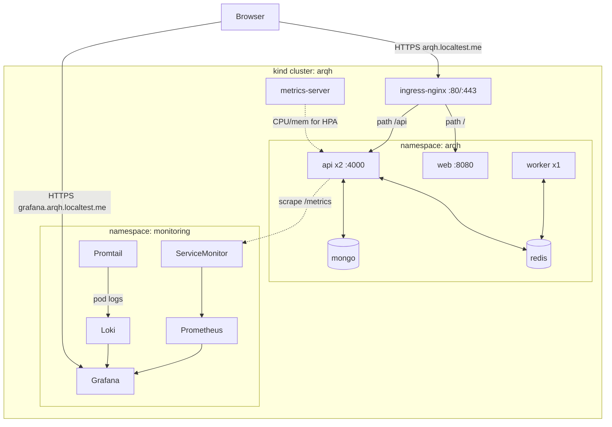

### Traffic through Ingress (TLS termination)

HTTPS is decrypted at Ingress; pods get plain HTTP in-cluster. `/metrics` is scraped via ClusterIP only (not an Ingress path).

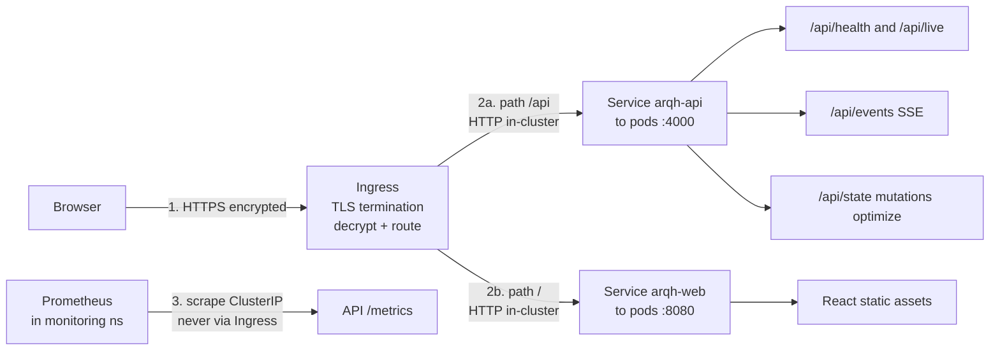

### Workloads & scaling

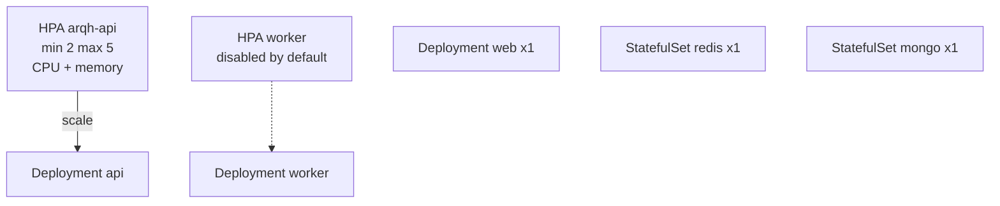

### Probe contract (readiness vs liveness)

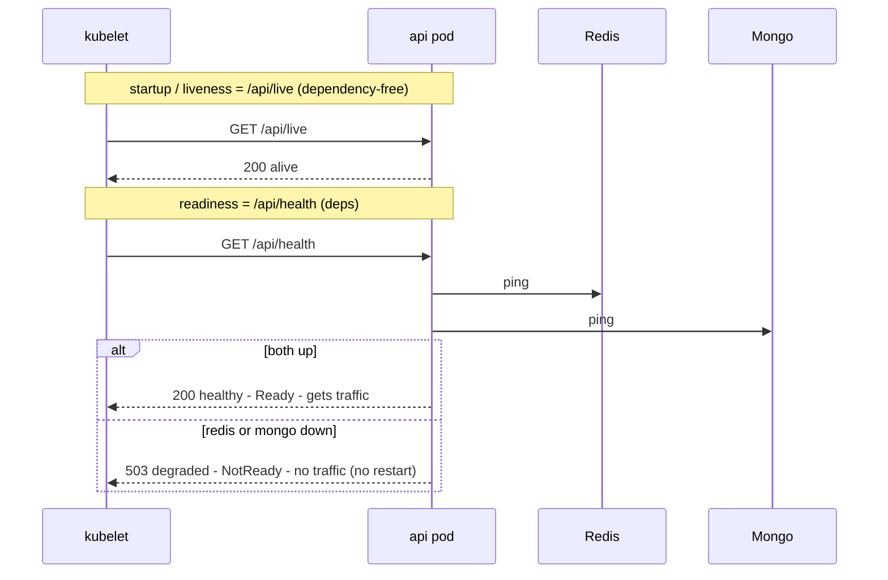

### Data & async flows

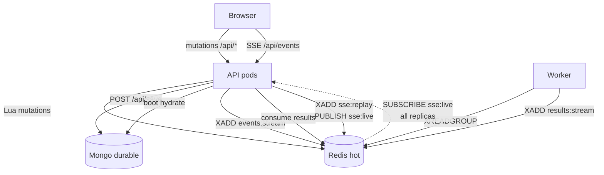

### Observability pipeline

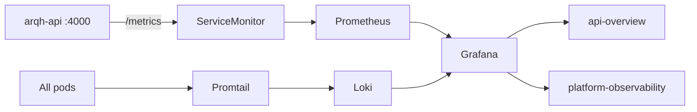

### Bootstrap lifecycle

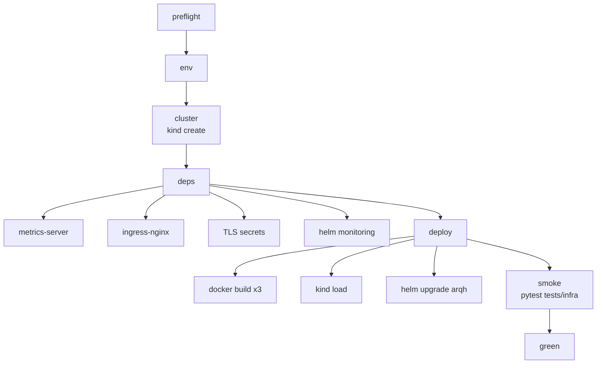

### Helm releases & render path

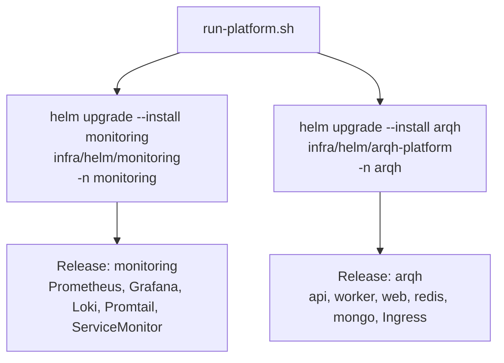

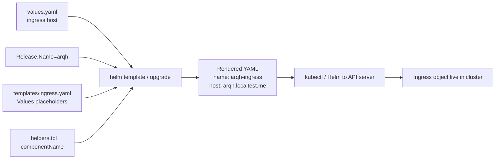

### CI/CD

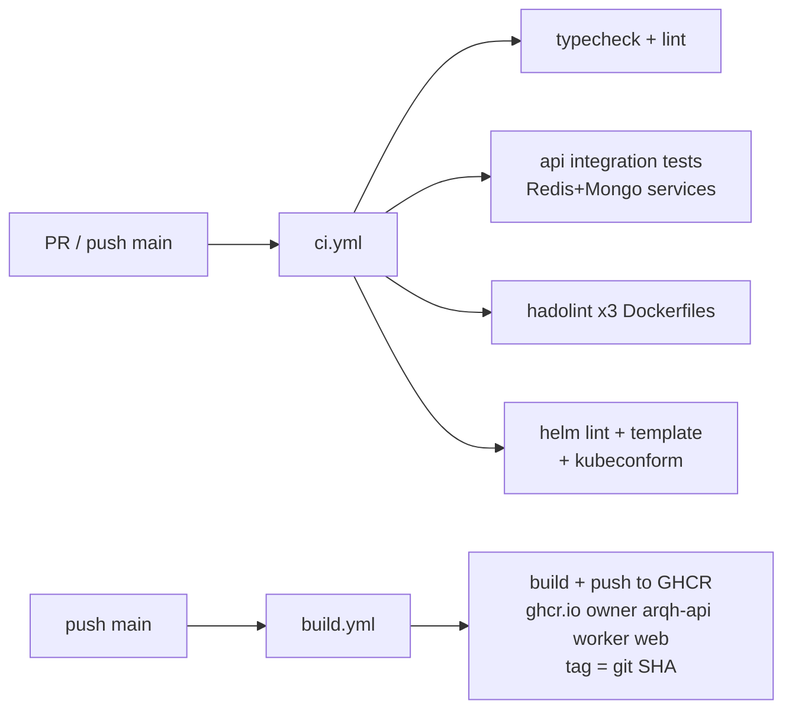

### Infra tests & config

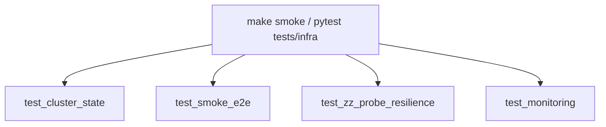

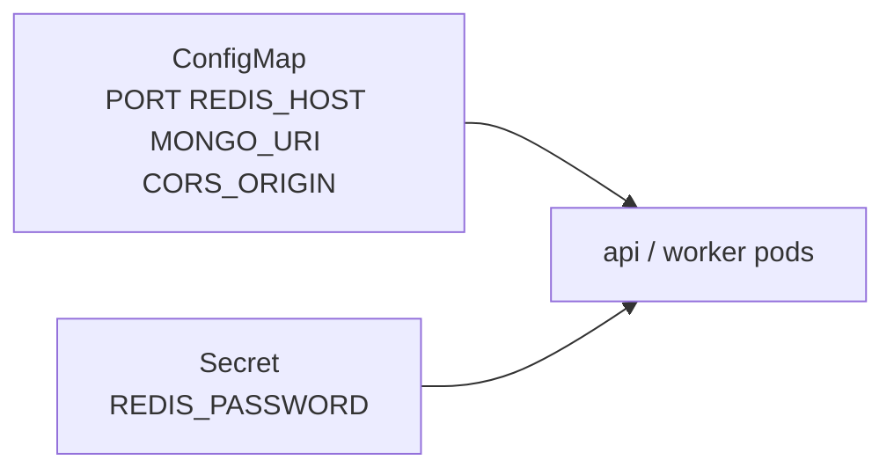

### Core Data Flow (app)

```
User Action → Frontend (optimistic UI update)
           → POST /api/assign (or /vehicles, /orders, etc.)
           → Lua script executes atomically in Redis
           → Rev incremented, SSE broadcast to all clients
           → MongoDB untouched (draft mode)

"Save Plan" → POST /api/save
           → Read full state from Redis (pipelined)
           → Write snapshot to MongoDB (durable persistence)

"Optimize"  → POST /api/optimize → 202 Accepted
           → XADD to events:stream
           → Worker: XREADGROUP → sleep + shuffle → XADD results:stream
           → API consumer: XREADGROUP → Lua update route → SSE broadcast

SSE live fan-out across API replicas uses Redis Pub/Sub (`sse:live`) after the
replay stream XADD, so a client connected to pod A still sees mutations handled on pod B.
```

## Key Design Decisions

| Decision                            | Rationale                                                                       |
| ----------------------------------- | ------------------------------------------------------------------------------- |
| **Bun monorepo** with `workspace:*` | Shared types, single `docker compose up`, no codegen                            |
| **Redis-first** writes              | Sub-ms latency for all dispatch mutations; Mongo only on boot + save            |
| **Lua scripts** for every mutation  | Atomic multi-key operations in a single round-trip; no race conditions          |
| **Zod schemas = source of truth**   | Types are _inferred_ from schemas (DRY); runtime validation at all boundaries   |
| **Hexagonal architecture**          | Domain ports + infra adapters; zero coupling between layers                     |
| **Redis Streams** for optimization  | Consumer groups, at-least-once delivery, built-in backpressure                  |
| **SSE** (not WebSocket)             | One-way push is all we need; browser-native reconnection; simpler than WS       |
| **Result\<T, E\> pattern**          | No thrown exceptions in business logic; explicit error flows in type signatures |
| **Optimistic Concurrency Control**  | Optional `baseRev` on every mutation prevents lost-update conflicts             |

## Observability & Monitoring

### Kubernetes (submission path)

The bootstrap installs a separate Helm release from [`infra/helm/monitoring`](infra/helm/monitoring):

| Component                        | Role                                                                 |
| -------------------------------- | -------------------------------------------------------------------- |
| Prometheus Operator + Prometheus | Scrapes the API via ServiceMonitor on ClusterIP `/metrics`           |
| Grafana                          | `https://grafana.arqh.localtest.me` (sidecar datasources/dashboards) |
| Loki + Promtail                  | Pod logs; LogQL `{app="arqh-api"}`                                   |

`/api/health` records `arqh_dependency_latency_ms` / `arqh_dependency_up` so dependency panels stay fresh. Chart dependencies are fetched with `helm dependency build` at bootstrap (`Chart.lock` committed; `charts/*.tgz` gitignored).

Operator walkthrough (creds, dashboards, smoke signals): see [How to check monitoring](#how-to-check-monitoring-operator-walkthrough) above.

### Compose fallback

`make compose-up` publishes Grafana at `http://localhost:3001`. Compose mounts only `packages/monitoring/grafana/provisioning/` — the K8s datasource file lives under `packages/monitoring/grafana/k8s/` so Compose does not load a second default Prometheus and crash.

### Metrics (Prometheus)

`prom-client` records `http_request_duration_ms` (`method`, `route`, `status_code`) plus the dependency gauges above. `/metrics` is mounted outside `/api/*` and is never routed by the public Ingress.

### Pre-provisioned Grafana Dashboards

| Dashboard                       | Panels                                                                                         |
| ------------------------------- | ---------------------------------------------------------------------------------------------- |
| **Arqh API Overview**           | Request heatmap, count by route, 4xx/5xx rates, CPU/mem, API logs                              |
| **Arqh Platform Observability** | Pod restarts, error-log spikes, 5xx by route, capacity vs limits, Redis/Mongo latency, heatmap |

### Log Aggregation (Loki + Promtail)

- **Compose:** `{service="api"} \| json`
- **Kubernetes:** `{app="arqh-api"} \| json` (Promtail relabels `app.kubernetes.io/*`)

---

## Production Deployment

The project includes a production deployment setup for bare-metal / VPS servers:

| Component       | Technology     | Details                                                                                            |
| --------------- | -------------- | -------------------------------------------------------------------------------------------------- |
| Process manager | PM2            | `ecosystem.config.cjs` for API + Worker                                                            |
| Web server      | Nginx (host)   | SSL via Let's Encrypt, SPA routing, API reverse proxy                                              |
| Monitoring      | Docker Compose | `docker-compose.monitoring.yml` (Prometheus, Grafana, Loki, Promtail)                              |
| Deploy          | `deploy.sh`    | One-script deploy: install → build → deploy static → reload nginx → restart PM2 → start monitoring |

```bash
# On the production server
bash deploy.sh
```

Security considerations:

- Prometheus, Loki, and Grafana ports bound to `127.0.0.1` only
- `/metrics` endpoint blocked on public-facing nginx vhosts
- Grafana: sign-up disabled, anonymous access disabled, strong admin password
- Grafana subdomain behind SSL (Let's Encrypt)

---

## CI

GitHub Actions now covers both **quality gates** and **image packaging**:

- **`ci.yml`** runs on pull requests and pushes to `main`:
  - installs dependencies with Bun
  - type-checks all workspaces (`bun run typecheck`)
  - runs web ESLint (`bun run lint`)
  - runs Prettier format check (`bun run format:check`)
  - runs Dockerfile lint (`hadolint`)
  - lints/renders the app chart (`values-ci.yaml`) and lints the monitoring chart
  - runs the API integration suite against real Redis + MongoDB service containers (`bun run test`)

- **`kind-smoke.yml`** runs on pull requests and pushes to `main`:
  - `./run-platform.sh up` with `IMAGE_TAG=sha-<git-sha>` and `SKIP_MONITORING=1`
  - Pillar C pytest through the Ingress (monitoring suite skipped with the stack)

- **`build.yml`** runs on pushes to `main` and `workflow_dispatch`:
  - builds `api`, `worker`, and `web` with Docker Buildx
  - reuses GitHub Actions cache layers
  - pushes SHA-tagged images to GHCR as `ghcr.io/<owner>/arqh-<component>:sha-<git-sha>`
  - also publishes `:latest` on the default branch as a convenience tag only

The Docker integration tests (`tests/integration-docker.ts`) are excluded from CI -- they target a running Docker stack and are run manually via `bun run test:docker`.

---

## Tech Stack

| Layer          | Technology                                                |
| -------------- | --------------------------------------------------------- |
| Runtime        | Bun                                                       |
| API Framework  | Express 5                                                 |
| Language       | TypeScript (strict mode)                                  |
| Hot State      | Redis + ioredis + Lua scripting                           |
| Durable State  | MongoDB (native driver)                                   |
| Messaging      | Redis Streams (consumer groups)                           |
| Real-time      | Server-Sent Events (SSE)                                  |
| Validation     | Zod 4 (schema-first type inference)                       |
| Frontend       | React 19 + Vite 7 + Zustand + TanStack Query              |
| Map            | React Leaflet (bonus feature)                             |
| Security       | Helmet + CORS + express-rate-limit                        |
| Logging        | Pino (structured JSON)                                    |
| Observability  | Prometheus + Grafana + Loki (K8s Helm + Compose fallback) |
| Infrastructure | Docker, kind, Helm, ingress-nginx, GitHub Actions         |

## License

Private -- Arqh

---

## Architecture Comparison Matrix (Pillar A + B + C + D)

Challenge-required section: for each non-obvious choice — **why**, **vs a direct alternative**,
**trade-offs / limitations**, and a **short next step**.

| Decision                | Chosen                                    | Alternative                        | Why chosen / trade-off                                                                  | Next step                                              |
| ----------------------- | ----------------------------------------- | ---------------------------------- | --------------------------------------------------------------------------------------- | ------------------------------------------------------ |
| Cluster                 | **kind** (multi-node)                     | minikube                           | Multi-node from YAML, fast, same tool in CI; must `kind load` local images              | Promote same config to a shared remote cluster         |
| Packaging               | **Helm** (app chart + monitoring chart)   | Kustomize / single mega-chart      | Values-driven toggles; monitoring upgrades without touching the app release             | Environment overlays (`values-staging.yaml`, etc.)     |
| Ingress                 | **ingress-nginx**                         | Traefik                            | Ubiquitous on kind; SSE needs `proxy-buffering=off` + long read timeouts                | Rate-limit / WAF annotations for public envs           |
| Ingress headers         | **ConfigMap + `proxy-set-headers`**       | `rewrite-target` / snippets        | Sets `X-Forwarded-*` after TLS; keeps `/api` path intact                                | cert-manager + real host headers                       |
| Ingress routing         | **Split** `/api`→api, `/`→web             | Route all via web nginx proxy      | API scales independently; `/metrics` stays off the public Ingress                       | Path-based canary / blue-green                         |
| Backing stores          | **In-cluster StatefulSets**               | External/managed DB                | Self-contained local demo; not production HA                                            | Document managed Redis/Mongo swap                      |
| Config vs secrets       | **ConfigMap + Secret** via `envFrom`      | Bake into image / single ConfigMap | Mirrors `env.ts`; secrets never land in ConfigMap                                       | Sealed Secrets / external-secrets                      |
| Liveness split          | **`/api/live`** + `/api/health` readiness | Single health probe for both       | Dependency-free liveness avoids restart loops on Redis/Mongo blips                      | Add startup backoff tuning per SLO                     |
| Web base image          | **nginx-unprivileged** (:8080)            | rootful `nginx:alpine` (:80)       | Non-root invariant; ARG for `FROM` declared before first stage                          | Evaluate distroless / chainguard                       |
| Multi-stage `FROM` ARGs | **Global ARG before first `FROM`**        | ARG only before second stage       | BuildKit otherwise resolves `${NGINX_IMAGE}` blank in CI                                | Pin digest refs for base images                        |
| Infra tests             | **pytest + k8s client** via Ingress       | Bash + kubectl / Terratest         | Readable assertions; no port-forward for app smoke (Prometheus scrape is the exception) | Assert per-pod health after failure injection          |
| Probe resilience order  | **`test_zz_*` last + N healthy samples**  | Probe before smoke / one 200       | Two API replicas: one healthy LB hit can leave the other degraded                       | Exec health checks per API pod                         |
| API replicas            | **min 2 + CPU/mem HPA**                   | Single replica                     | Exercises multi-pod behavior early; needs shared SSE bus                                | Tune HPA thresholds from real load                     |
| API disruption          | **PDB + soft anti-affinity**              | Required anti-affinity / no PDB    | Drain-safe; preferred affinity still schedules on cramped kind                          | Hard anti-affinity when node count ≥ 3                 |
| NetworkPolicy           | **Datastore allowlists**                  | Open namespace / service mesh      | Redis/Mongo only from api/worker; api/web from Ingress                                  | Egress allowlists beyond Ingress/datastores            |
| SSE fan-out             | **Redis Pub/Sub (`sse:live`)**            | Sticky sessions / in-memory only   | Mutations on pod B reach SSE clients on pod A; replay still via Redis Stream            | Streams consumer group if fan-out grows                |
| Worker scaling          | **CPU HPA (optional)**                    | KEDA on stream lag                 | Simple for the demo; not lag-aware                                                      | KEDA on `events:stream` lag                            |
| TLS (local)             | **Self-signed secret per host**           | cert-manager                       | Zero extra controllers; browser warning + manual cert                                   | cert-manager in real envs                              |
| Local image tags        | **`:local` + `IfNotPresent`**             | `:latest`                          | Deterministic on kind; no `:latest` in app manifests                                    | Prefer digest pulls outside kind                       |
| CI image tags           | **`values-ci.yaml` + `sha-<git-sha>`**    | `:latest` in CI overlay            | kind-smoke / helm lint stay on immutable tags; `sha-ci` is lint-only placeholder        | Pull GHCR SHAs on `main` after `build.yml`             |
| CI/CD engine            | **GitHub Actions** (`ci`/`build`/`smoke`) | CircleCI / one monolithic pipeline | Native status checks; kind-smoke closes the deploy loop on every PR                     | Required status checks on the private fork             |
| kind-smoke scope        | **`SKIP_MONITORING=1` in CI**             | Full monitoring in every PR        | Fits GitHub-hosted runners; full Grafana/Prom/Loki stays on `make bootstrap`            | Optional obs smoke on a larger runner                  |
| Format gate             | **Prettier `format:check` in CI**         | Local-only / Biome                 | Matches challenge formatting gate; scoped away from Go-templated Helm YAML              | Optional pre-commit hook                               |
| Dockerfile lint         | **hadolint**                              | Dockle                             | Strong best-practice feedback with easy CI integration                                  | Image CVE scan (Trivy/Grype)                           |
| Manifest schema         | **helm lint + kubeconform**               | kube-linter / conftest             | Lightweight chart+schema validation (app + monitoring)                                  | Policy-as-code (OPA/Conftest)                          |
| Registry delivery       | **GHCR + SHA tags**                       | Docker Hub / kind-load only        | Immutable deploy tags; fork package visibility needs care                               | Wire `main` smoke to GHCR pulls                        |
| Observability           | **kube-prometheus-stack + Loki**          | Managed APM / embed in app chart   | Operator CRDs + Grafana/Loki quickly; more third-party surface area                     | Alertmanager rules for restart/error spikes            |
| Chart deps              | **`helm dependency build` + Chart.lock**  | Vendor `.tgz` in git               | Pins versions without bloating the repo (~1MB binaries)                                 | CI chart cache if fetch is flaky                       |
| Metrics exposure        | **ServiceMonitor (ClusterIP)**            | Ingress `/metrics`                 | Keeps scrape private; fits Prometheus Operator                                          | NetworkPolicy for scrape path only                     |
| Grafana access          | **Dedicated ingress host + TLS**          | port-forward only                  | Demo/screenshot UX; creds under `.tmp/k8s/grafana-admin.env`                            | SSO / cert-manager                                     |
| Grafana datasources     | **Split compose vs K8s files**            | One shared YAML folder             | Prevents Compose crash on duplicate `isDefault` Prometheus                              | Unified templated datasource chart                     |
| Compose baseline        | **Kept as `compose-*` fallback**          | Delete compose entirely            | Useful no-K8s path; submission default remains `make bootstrap`                         | Drop compose once K8s-only is mandated                 |
