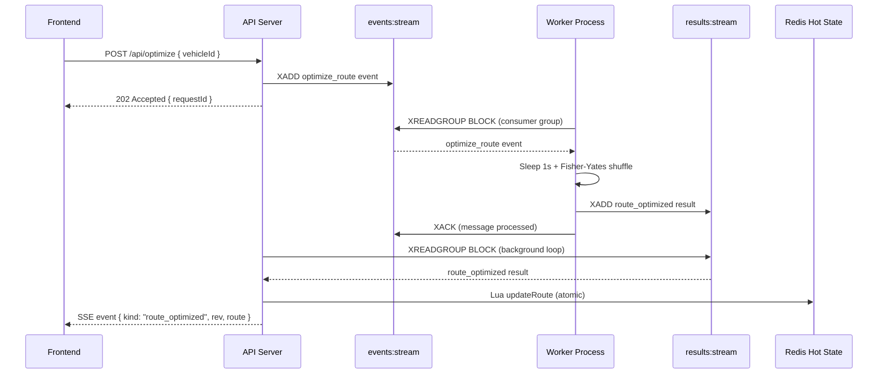
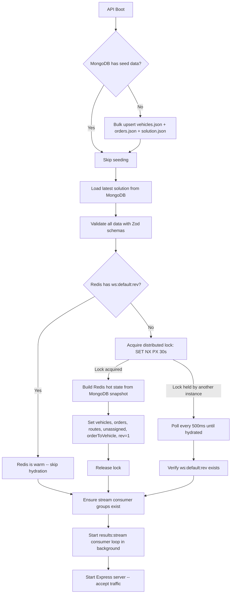

#  Mission Control Backend

> Redis-first write-behind cache architecture with event-driven workers, Lua-scripted atomic mutations, and SSE real-time updates for the Dispatch logistics dispatch system.

---

## Table of Contents

- [Architecture](#architecture)
- [Why This Architecture](#why-this-architecture)
- [Why Lua Scripts on Redis](#why-lua-scripts-on-redis)
- [Redis Keyspace Design](#redis-keyspace-design)
- [Streams Architecture](#streams-architecture)
- [Startup / Hydration Flow](#startup--hydration-flow)
- [Project Structure](#project-structure)
- [SOLID & DRY Principles](#solid--dry-principles)
- [API Endpoints](#api-endpoints)
- [Getting Started](#getting-started)
- [Testing](#testing)
- [Security](#security)
- [Docker](#docker)

---

## Architecture

```
┌──────────────┐    ┌───────────────┐    ┌──────────────┐
│   Frontend   │───▶│   Express API │───▶│    Redis     │
│  (SSE client)│◀───│  (Bun runtime)│◀───│  (hot state) │
└──────────────┘    └───────┬───────┘    └──────────────┘
                            │                    │
                    ┌───────▼───────┐    ┌───────▼───────┐
                    │   MongoDB     │    │ Redis Streams  │
                    │ (durable store)│    │ events:stream  │
                    └───────────────┘    │ results:stream │
                                         └───────┬───────┘
                                         ┌───────▼───────┐
                                         │    Worker      │
                                         │  (optimizer)   │
                                         └───────────────┘
```

The system implements a **Redis-first write-behind cache** pattern:

1. **All high-frequency reads and writes hit Redis only** -- dispatchers make hundreds of rapid changes, and we need sub-millisecond response times.
2. **MongoDB is the durable backup** -- written only at startup (seed) and when the user explicitly clicks "Save Plan."
3. **Heavy computation is event-driven** -- optimization requests flow through Redis Streams to decoupled worker processes, with results pushed back via SSE.

---

## Why This Architecture

### Redis-First ("Hot State") Instead of Direct DB Writes

The task specification states: *"We cannot hit the database for every single move. Instead, we treat Redis as the 'Hot State' and MongoDB as the 'Durable State'."*

This maps directly to the **write-behind cache** pattern:

- **Reads**: `GET /api/state` reads from Redis via a pipelined batch (one round-trip for all vehicles, orders, routes, and unassigned set). Typical latency: <2ms.
- **Writes**: Every mutation (assign, CRUD, optimize result) updates Redis atomically via Lua scripts. MongoDB is never touched.
- **Persistence**: Only when the user clicks "Save Plan" does the API read the full Redis state and write a snapshot to MongoDB.
- **Hydration**: On startup, if Redis is cold (no `ws:default:rev` key), the API loads the latest snapshot from MongoDB and rebuilds the entire Redis hot state.

This gives us the best of both worlds: Redis speed for interactive use, MongoDB durability for persistence.

### Hexagonal Architecture (Ports & Adapters)

Every application service depends on **interfaces** (ports), never on Redis or MongoDB directly:

```
domain/ports/
  draft-store.port.ts      →  IDraftStore    (implemented by RedisDraftStore)
  durable-store.port.ts    →  IDurableStore  (implemented by MongoDurableStore)
  stream-publisher.port.ts →  IStreamPublisher
  stream-consumer.port.ts  →  IStreamConsumer
  realtime.port.ts         →  IRealtimeGateway (implemented by SseGateway)
```

**Why this matters:**

- **Testability**: Services are factory functions that accept port interfaces. You can mock Redis/Mongo trivially.
- **Swappability**: Want to replace Redis with DragonflyDB? Implement `IDraftStore`. Want PostgreSQL instead of MongoDB? Implement `IDurableStore`. Zero changes to business logic.
- **Dependency Inversion (the D in SOLID)**: The domain layer has zero `import` statements referencing infrastructure. All wiring happens in `config/container.ts` (the composition root).

### Zod Schemas as the Single Source of Truth

All TypeScript types are **inferred** from Zod schemas. We never define a type and a schema separately:

```typescript
// packages/shared/src/schemas/vehicle.schema.ts
export const VehicleSchema = z.object({
  id: z.string().min(1),
  name: z.string().min(1),
  capacity_kg: z.number().positive(),
  start_location: LocationSchema,
});

export type Vehicle = z.infer<typeof VehicleSchema>;
```

This is shared between backend and frontend via `@repo/shared`. One definition. Zero drift. If a field changes, both apps update or break at compile time.

### Result\<T, E\> Instead of Thrown Exceptions

Services return discriminated unions instead of throwing:

```typescript
type Result<T, E = AppError> =
  | { readonly ok: true; readonly value: T }
  | { readonly ok: false; readonly error: E };
```

**Why?**
- Error paths are visible in type signatures (not hidden in `catch` blocks).
- Controllers unwrap results explicitly -- no surprise exceptions.
- A `tryCatch` helper converts `AppError` throws from Lua/Redis into `Result` automatically (DRY).

---

## Why Lua Scripts on Redis

This is the most critical architectural decision in the backend. Every state mutation runs as a **Lua script** executed atomically inside Redis.

### The Problem: Race Conditions

Consider assigning an order to a vehicle. Without atomicity, this requires multiple Redis commands:

1. Check if the order exists (`HEXISTS orders orderId`)
2. Check if the vehicle exists (`HEXISTS vehicles vehicleId`)
3. Find the order's current location (`HGET orderToVehicle orderId`)
4. Remove from old location (`LREM route:oldVehicle` or `SREM unassigned`)
5. Add to new location (`RPUSH route:vehicleId` or `SADD unassigned`)
6. Update mapping (`HSET orderToVehicle orderId vehicleId`)
7. Increment revision (`INCR rev`)

If two users reassign the same order simultaneously, steps 3-7 can interleave and corrupt state. Redis transactions (`MULTI/EXEC`) don't help because they can't read values mid-transaction (no conditional logic).

### The Solution: Lua Scripts

Redis executes Lua scripts **atomically** -- the entire script runs as a single operation. No other command can interleave. This gives us:

- **Atomicity**: All 7 steps above happen in one round-trip, one atomic execution.
- **Conditional logic**: The script reads current state and branches (assign vs. unassign vs. reassign) server-side.
- **Optimistic Concurrency Control**: The script checks `baseRev` against the current `rev` and returns `-3` (conflict) if they don't match -- all within the same atomic execution.
- **Performance**: One network round-trip instead of seven. Scripts are SHA-1 cached (`EVALSHA`), so only 40 bytes are sent per call, not the full script.

### The Six Lua Scripts

| Script | Purpose | Atomic Operations |
|--------|---------|-------------------|
| `assignOrder` | Assign / unassign / reassign with positional insert | Read mapping, remove from old location, insert at position in new location, update mapping, increment rev |
| `deleteVehicle` | Remove vehicle + cascade unassign all orders | Read route, move each order to unassigned, update all mappings, delete route + vehicle, increment rev |
| `deleteOrder` | Remove order from wherever it lives | Read mapping, remove from route or unassigned, delete from orders hash + mapping, increment rev |
| `updateRoute` | Apply optimization result | Delete old route list, rebuild with new order sequence, increment rev |
| `setOrder` | Create/update order (new orders auto-unassigned) | Upsert in orders hash, if new: add to unassigned + mapping, increment rev |
| `setVehicle` | Create/update vehicle | Upsert in vehicles hash, increment rev |

All scripts follow the same conventions:
- **KEYS[]** = static Redis key names (required for Redis Cluster compatibility)
- **ARGV[]** = dynamic arguments; last ARGV is always `baseRev` (-1 to skip OCC)
- **Returns**: positive integer = new rev (success); negative integer = error code
- **Error codes**: `-1` = order not found, `-2` = vehicle not found, `-3` = revision conflict

### SHA-1 Script Caching

Scripts are loaded once at startup via `SCRIPT LOAD` and called via `EVALSHA` thereafter. The `LuaScriptManager` handles this transparently:

```typescript
// First call: loads script, caches SHA-1
await scripts.exec(redis, "assignOrder", KEYS, ARGV);

// Subsequent calls: sends only the 40-byte SHA-1 hash
// If Redis restarts (SHA-1 lost), auto-reloads on NOSCRIPT error
```

---

## Redis Keyspace Design

All keys are namespaced under `ws:default:` for future multi-tenant / multi-workspace support:

| Key | Type | Contents |
|-----|------|----------|
| `ws:default:vehicles` | HASH | `vehicleId` -> Vehicle JSON |
| `ws:default:orders` | HASH | `orderId` -> Order JSON |
| `ws:default:route:{vehicleId}` | LIST | Ordered list of `orderId`s (the route) |
| `ws:default:unassigned` | SET | Set of unassigned `orderId`s |
| `ws:default:orderToVehicle` | HASH | `orderId` -> `vehicleId` or `"UNASSIGNED"` |
| `ws:default:rev` | STRING (INT) | Monotonic revision counter |
| `ws:default:lastSavedRev` | STRING (INT) | Last revision persisted to MongoDB |
| `ws:default:hydrating` | STRING | Distributed lock (SET NX PX) for hydration |

**Key design rationale:**

- **`orderToVehicle` reverse index**: O(1) lookup of where any order lives. Without this, finding an order's current vehicle requires scanning all route lists -- O(V*R).
- **`unassigned` as a SET**: O(1) add/remove/membership-check. The Lua scripts maintain this set automatically.
- **`rev` counter**: Monotonically incremented by every Lua script. Enables Optimistic Concurrency Control and SSE event ordering.
- **LIST for routes** (not sorted sets): Routes have a meaningful sequence (stop order). LISTs preserve insertion order and support positional insert.

---

## Streams Architecture



### Stream Details

| Stream | Consumer Group | Consumer | Purpose |
|--------|---------------|----------|---------|
| `events:stream` | `opt-workers` | `worker-1` | Optimization requests from API to workers |
| `results:stream` | `api-updaters` | `api-1` | Optimization results from workers back to API |

Both streams use `MAXLEN ~ 10000` for automatic cap trimming.

### Worker Reliability

Both the worker and API results consumer implement a **stale-claim pattern** for crash recovery, centralized in `RedisStreamConsumer`:

- When `staleClaimMs` is configured (default: 60s), the consumer periodically runs `XPENDING` to find idle messages.
- Stale messages are reclaimed via `XCLAIM` and reprocessed.
- This ensures no message is lost, even if a consumer crashes mid-processing.
- The logic is DRY -- both the worker and API consumer share the same `RedisStreamConsumer` implementation.

---

## Startup / Hydration Flow



### Auto-Rehydration Guard

A middleware detects if Redis loses state mid-operation (e.g., Redis restart) and transparently re-hydrates from MongoDB:

1. Before every data route, check if `ws:default:rev` exists (one O(1) Redis GET).
2. If missing, acquire the hydration lock and rebuild from the latest MongoDB snapshot.
3. The request continues normally after rehydration completes.

This makes the system resilient to Redis restarts without manual intervention.

---

## Project Structure

```
apps/api/
├── src/
│   ├── config/
│   │   ├── env.ts                 # Zod-validated environment config (fail-fast on bad env)
│   │   ├── redis-keys.ts          # Keyspace constants (ws:default:*)
│   │   └── container.ts           # Composition root / DI wiring (no framework)
│   │
│   ├── domain/
│   │   ├── errors.ts              # AppError hierarchy (validation, not-found, conflict, internal)
│   │   └── ports/                 # Interfaces only -- zero infrastructure dependencies
│   │       ├── draft-store.port.ts        # IDraftStore (Redis abstraction)
│   │       ├── durable-store.port.ts      # IDurableStore (MongoDB abstraction)
│   │       ├── stream-publisher.port.ts   # IStreamPublisher
│   │       ├── stream-consumer.port.ts    # IStreamConsumer
│   │       └── realtime.port.ts           # IRealtimeGateway (SSE)
│   │
│   ├── application/
│   │   ├── services/              # Business logic (each returns Result<T, AppError>)
│   │   │   ├── hydration.service.ts       # Startup: seed Mongo -> hydrate Redis
│   │   │   ├── state.service.ts           # GET /api/state (pipelined Redis reads)
│   │   │   ├── assignment.service.ts      # Assign/unassign/reassign via Lua
│   │   │   ├── vehicle.service.ts         # Vehicle CRUD (Redis-first)
│   │   │   ├── order.service.ts           # Order CRUD (Redis-first)
│   │   │   ├── optimization.service.ts    # XADD to events:stream -> 202 Accepted
│   │   │   ├── save-plan.service.ts       # Read Redis -> write MongoDB snapshot
│   │   │   └── results-handler.ts         # Consume results:stream -> Lua updateRoute -> SSE
│   │   └── helpers.ts             # tryCatch utility (AppError -> Result conversion)
│   │
│   ├── infrastructure/
│   │   ├── redis/
│   │   │   ├── redis-client.ts            # ioredis factory (singleton + dedicated connections)
│   │   │   ├── redis-draft-store.ts       # IDraftStore implementation (pipelines + Lua)
│   │   │   ├── redis-stream-publisher.ts  # IStreamPublisher implementation (XADD)
│   │   │   ├── redis-stream-consumer.ts   # IStreamConsumer implementation (XREADGROUP loop)
│   │   │   └── lua/
│   │   │       ├── scripts.ts             # 6 Lua scripts (inline TypeScript strings)
│   │   │       └── script-manager.ts      # SHA-1 caching + EVALSHA executor
│   │   ├── mongo/
│   │   │   ├── mongo-client.ts            # MongoClient singleton
│   │   │   └── mongo-durable-store.ts     # IDurableStore implementation
│   │   └── sse/
│   │       └── sse-gateway.ts             # IRealtimeGateway implementation
│   │
│   ├── interface/
│   │   ├── controllers/           # Thin HTTP controllers (parse -> call service -> respond)
│   │   ├── routes/                # Express route factories (DIP wiring per endpoint)
│   │   └── middleware/
│   │       ├── validate.ts                # Generic Zod validation factory (DRY)
│   │       ├── error-handler.ts           # Central error -> { code, message, details? }
│   │       ├── security.ts                # Helmet + CORS + rate limiter
│   │       ├── metrics.ts                 # Prometheus histogram + /metrics handler (~0.01ms overhead)
│   │       └── rehydration-guard.ts       # Auto-rehydration on cold Redis
│   │
│   ├── shared/
│   │   ├── result.ts              # Result<T, E> discriminated union + ok/err constructors
│   │   └── logger.ts              # Pino structured logger
│   │
│   ├── server.ts                  # Express app factory (middleware order documented)
│   ├── bootstrap.ts               # Main entry: wire DI -> hydrate -> consumer -> serve
│   └── worker.ts                  # Optimization worker (separate OS process)
│
├── tests/
│   ├── setup.ts                   # Full server bootstrap + DRY HTTP client helpers
│   └── api.test.ts                
│
├── data/                          # Seed JSON files
│   ├── vehicles.json
│   ├── orders.json
│   └── solution.json
│
├── Dockerfile                     # API server (monorepo-aware multi-stage)
├── Dockerfile.worker              # Worker process
├── package.json
└── tsconfig.json
```

---

## SOLID & DRY Principles

### Single Responsibility (S)

- **Controllers** only extract request data and call services -- zero business logic.
- **Services** only orchestrate domain operations -- zero HTTP awareness.
- **Lua scripts** only handle atomic state transitions -- zero business rules beyond data integrity.

### Open/Closed (O)

- Adding a new entity type (e.g., `Driver`) means: add a Zod schema in `@repo/shared`, add a service, add a route factory. Existing code is untouched.
- The `validate()` middleware factory is generic -- new endpoints just pass their Zod schema: `validate({ body: NewSchema })`.

### Liskov Substitution (L)

- All port interfaces are substitutable. `MongoDurableStore` can be replaced with `PostgresDurableStore` without changing any service code.

### Interface Segregation (I)

- `IDraftStore` has vehicle ops, order ops, assignment ops, and hydration -- each service only depends on the methods it uses (TypeScript structural typing handles this naturally).
- `IRealtimeGateway` is separate from `IDraftStore` -- the SSE system doesn't depend on Redis internals.

### Dependency Inversion (D)

- The `domain/` folder has zero imports from `infrastructure/`. All wiring happens in `config/container.ts`.
- Services are factory functions that accept port interfaces:

```typescript
export const createAssignmentService = (deps: {
  draftStore: IDraftStore;
  gateway: IRealtimeGateway;
}) => ({
  assignOrder: async (req: AssignRequest): Promise<Result<AssignResponse, AppError>> => { ... }
});
```

### DRY Highlights

| Pattern | What it eliminates |
|---------|-------------------|
| `tryCatch(fn)` | Repetitive try/catch + Result wrapping in every service method |
| `sendResult(result, res, next)` | Repetitive `if (ok)` / `else next(error)` in every controller |
| `validate({ body, params, query })` | Per-route validation boilerplate (one generic factory) |
| `checkLuaResult(code, ctx)` | Repetitive Lua error-code-to-AppError mapping |
| `baseRevField` Zod mixin | DRY OCC field added to all mutation schemas |
| `OCC_CHECK` Lua snippet | Inlined into all 6 scripts via template literal |
| `@repo/shared` barrel | One import for any schema or type across the entire monorepo |

---

## API Endpoints

| Method | Path | Description | Response |
|--------|------|-------------|----------|
| `GET` | `/metrics` | Prometheus metrics (internal-only, not under /api) | `200 text/plain` |
| `GET` | `/api/health` | Health check (Redis + MongoDB latency) | `200 { status, services, uptime_s }` |
| `GET` | `/api/state` | Full planning state from Redis (pipelined) | `200 { vehicles, orders, solution, unassignedOrderIds, rev }` |
| `GET` | `/api/events` | SSE stream (real-time state change events) | `200 text/event-stream` |
| `POST` | `/api/assign` | Assign / unassign / reassign order (Lua) | `200 { rev, success }` |
| `POST` | `/api/optimize` | Request async route optimization | `202 { requestId, eventId }` |
| `POST` | `/api/save` | Persist Redis state to MongoDB | `200 { success, savedRev, savedAt }` |
| `POST` | `/api/vehicles` | Create vehicle (Redis-first) | `201 { vehicle, rev }` |
| `PUT` | `/api/vehicles/:id` | Update vehicle | `200 { vehicle, rev }` |
| `DELETE` | `/api/vehicles/:id` | Delete vehicle + cascade unassign | `200 { unassignedOrderIds, rev }` |
| `POST` | `/api/orders` | Create order (auto-unassigned) | `201 { order, rev }` |
| `PUT` | `/api/orders/:id` | Update order | `200 { order, rev }` |
| `DELETE` | `/api/orders/:id` | Delete order + remove from route | `200 { rev }` |

All mutation endpoints support an optional `baseRev` parameter for **Optimistic Concurrency Control**. If the provided `baseRev` doesn't match the current state revision, the API returns `409 Conflict` -- the client must re-fetch state and retry.

---

## Getting Started

### Prerequisites

- [Bun](https://bun.sh) >= 1.0
- Redis >= 7.0
- MongoDB >= 6.0

### Local Development

```bash
# From the monorepo root
bun install

# Copy and configure local environment
cp .env.example .env

# Start the API (hot reload)
bun run dev:api

# Start the optimization worker (separate terminal)
bun run dev:worker
```

### Environment Files

| File | Used by | Notes |
|------|---------|-------|
| `.env` | Local API/worker runtime and production host runtime | Production should provide secure values via deployment secrets or environment variables. |
| `.env.docker` | Docker Compose API/worker/web containers | Copy from `.env.docker.example`; uses Docker service names (`redis`, `mongo`). |
| `.env.test` | API integration tests | Loaded automatically by `bun run --cwd apps/api test` (`--env-file=../../.env.test`). |

### Docker

```bash
# From the monorepo root
cp .env.docker.example .env.docker

# Builds and starts api, worker, redis, mongo
docker compose up --build api worker redis mongo
```

The API Dockerfile is monorepo-aware: it copies `packages/shared` alongside `apps/api` so that workspace imports resolve correctly inside the container.

---

## Testing

```bash
# Run the full integration test suite against real Redis + MongoDB
bun run --cwd apps/api test

# Run Docker integration tests against a running container stack
# (generates Prometheus metrics visible in Grafana)
API_URL=http://127.0.0.1:4000 bun run test:docker
```

**Test suite:**

| Suite | File | What it tests |
|-------|------|--------------|
| Integration | `tests/api.test.ts` | 44 tests against real Redis + MongoDB (boots fresh server per run) |
| Docker | `tests/integration-docker.ts` | 11 tests against live Docker containers (exercises all routes for Grafana metrics) |
| Setup | `tests/setup.ts` | DRY test infrastructure: server bootstrap, HTTP client helpers, seed data |

Tests run against **real infrastructure** (no mocks). Each test suite boots a fresh server with a clean Redis + MongoDB state, runs a sequential story-driven flow (create -> mutate -> verify -> delete -> verify), and tears everything down.

---

## Security

| Layer | Implementation |
|-------|---------------|
| **Headers** | Helmet sets X-Content-Type-Options, X-Frame-Options, HSTS, and 10+ other security headers |
| **CORS** | Configurable via `CORS_ORIGIN` env var (defaults to `*` for development); `credentials` is automatically disabled when using wildcard origin to comply with browser Fetch spec |
| **Rate limiting** | 100 req/min general, 30 req/min for `/api/assign`, `/api/optimize`, `/api/save` |
| **Validation** | Every request body, URL parameter, and query string is Zod-validated before reaching business logic |
| **Error handling** | Central handler returns `{ code, message, details? }` -- no stack traces leak in production |
| **Auto-rehydration** | Middleware detects cold Redis and transparently restores from MongoDB (distributed lock prevents stampede) |
| **Observability** | `prom-client` exposes `http_request_duration_ms` histogram (method, route, status_code) + default process metrics; `/metrics` mounted outside `/api/*` and blocked on public nginx |
| **No auth** | Not required by spec, but the middleware pipeline is structured so auth can be slotted in (Open/Closed) |

---

## Docker

The API and worker use separate Dockerfiles but share the same monorepo build context:

```dockerfile
# apps/api/Dockerfile (simplified)
FROM oven/bun:1
WORKDIR /app

# Copy workspace root + shared package + API package
COPY package.json bun.lock ./
COPY packages/shared/ packages/shared/
COPY apps/api/ apps/api/

RUN bun install --frozen-lockfile --production

WORKDIR /app/apps/api
CMD ["bun", "run", "src/bootstrap.ts"]
```

Both images are built from the **monorepo root** (`context: .`) so they can resolve `@repo/shared` workspace imports.
