# 10 — Platform Architecture (Visual)

> Load when: you need the full platform picture — topology, traffic, probes, CI, tests, observability — with code pointers.
> Prereqs:   [`AGENTS.md`](../AGENTS.md) · optional: [`00-overview`](00-overview.md)
> Status:    REFERENCE

**Scope:** infrastructure we own (Pillars A–D + deliverables). App business logic is frozen; only packaging / probes / metrics / SSE fan-out are touched in `apps/api`.

---

## Legend (diagram symbols)

| Symbol / term | Meaning |
|---------------|---------|
| `▶` | Request / traffic direction |
| `<-->` | Bidirectional (read + write) in Mermaid diagrams |
| `ClusterIP` | Service reachable **only inside** the cluster (not via public Ingress) |
| `Ready` | Pod passes **readiness** → receives traffic |
| `Alive` | Pod passes **liveness** → kubelet will not restart it |
| `hot` | See **Hot vs durable** below |
| `durable` | See **Hot vs durable** below |
| `ns/dispatch` | App namespace + Helm release name |
| `ns/monitoring` | Observability stack namespace |

#### Hot vs durable (Redis vs Mongo)

Think **scratchpad** vs **saved file**.

| | **Hot** (Redis) | **Durable** (Mongo) |
|--|-----------------|---------------------|
| **What** | The *live* dispatch plan the UI edits right now (vehicles, orders, routes, `rev`) | A *saved snapshot* of that plan on disk |
| **Where** | In-memory Redis | MongoDB collections |
| **Speed** | Sub-ms reads/writes (Lua mutations) | Slower; used when you need persistence |
| **Survives pod restart?** | Only while Redis keeps the data — lost if Redis is wiped/empty | Yes — survives API/Redis restarts |
| **When written** | Every mutation (`/api/assign`, orders, …) | Explicit **Save plan** (`POST /api/save`) |
| **When read** | Almost every request + SSE | Boot **hydration** (Mongo → Redis) and rehydration if Redis went cold |

```text
Edit in UI  ──▶  Redis (hot / draft)     ← day-to-day work happens here
                      │
         POST /api/save
                      ▼
                 Mongo (durable)         ← “commit” so it outlives crashes

Boot / empty Redis ── hydration ──▶ copy Mongo → Redis, then serve from hot again
```

| Term in docs | Same idea |
|--------------|-----------|
| hot / draft / live state | Redis |
| durable / snapshot / saved plan | Mongo |

App sources: Redis draft store · Mongo durable store · hydration in API bootstrap. Glossary also in [`00-overview.md`](00-overview.md).

| Host | Serves |
|------|--------|
| `https://dispatch.localtest.me` | App (web + `/api`) |
| `https://grafana.dispatch.localtest.me` | Grafana UI |

---

## Glossary — technologies (plain language)

Same mental model as [`07-user-docs.md`](07-user-docs.md): kitchen = app, manager = Kubernetes, CCTV = observability.

### Runtime & app

| Term | What it is (here) |
|------|-------------------|
| **Bun** | Fast JS runtime (like Node). Runs the API and worker. |
| **Express** | HTTP framework on the API — routes like `/api/state`, `/api/health`. |
| **API** | Front desk of the backend: HTTP + SSE; mutates Redis; talks to Mongo. |
| **Worker** | Background process for slow optimize jobs so the API stays snappy. Talks only via Redis Streams. |
| **React / web** | Browser UI. Built as static files; **nginx** serves them. App source under `apps/web/src` is frozen. |
| **nginx-unprivileged** | nginx image that runs as non-root on port **8080** (K8s-friendly). |
| **Redis** | In-memory store = short-term memory. Hot state + Streams (queue) + Pub/Sub (SSE fan-out). |
| **MongoDB** | Disk DB = long-term memory. Durable snapshots on save / hydration source on boot. |
| **Lua (in Redis)** | Tiny scripts that run **inside** Redis so multi-key mutations are atomic (one round-trip). |
| **SSE** | Server-Sent Events — one-way push from API → browser (not WebSocket). Endpoint `/api/events`. |
| **Redis Streams** | Append-only log + consumer groups (`XADD` / `XREADGROUP`). Used for optimize jobs (`events` / `results`) and SSE replay (`sse:replay`). |
| **Pub/Sub** | Fire-and-forget channel (`PUBLISH` / `SUBSCRIBE`). We use `sse:live` so **every** API replica sees live events. |
| **Hydration** | Boot: Mongo → warm Redis + create stream groups. |
| **Rev / OCC** | Optimistic concurrency: mutations may send `baseRev` so two clients don’t overwrite each other. |

### Packaging & orchestration

| Term | What it is (here) |
|------|-------------------|
| **Docker** | Packages code + deps into an **image**; a running copy is a **container**. |
| **Kubernetes (K8s)** | Orchestrator: keep N healthy pods, restart crashes, scale, route traffic. |
| **kind** | “Kubernetes IN Docker” — real multi-node cluster on your laptop. |
| **Pod** | Smallest K8s unit: one or more containers that share network/storage. |
| **Deployment** | Manages stateless replicas (api / worker / web) and rolling updates. |
| **StatefulSet** | Like Deployment but stable identity/storage (redis / mongo). |
| **Service** | Stable in-cluster DNS + load-balance to pods (`dispatch-api`, …). |
| **Namespace** | Soft isolation: `dispatch` (app) vs `monitoring` (observability). |
| **Helm** | Installer/templater for K8s YAML. One **chart** + `values.yaml` → whole stack. See **Helm deep dive** below. |
| **Ingress** | Cluster front door: host + path routing + TLS termination. |
| **TLS termination** | HTTPS is decrypted at Ingress; pods get plain HTTP in-cluster. Users still use HTTPS. |
| **ingress-nginx** | Ingress controller we install on kind (listens host :80/:443). |
| **TLS** | Encryption for HTTPS. Local self-signed certs → Secret on the Ingress. |
| **HPA** | Horizontal Pod Autoscaler — adds/removes pods from CPU/memory vs **requests**. |
| **metrics-server** | Feeds pod CPU/memory to the HPA (needs a kind TLS patch). |
| **Probe** | Periodic HTTP check by kubelet. See §4. |
| **requests / limits** | CPU/memory guarantee (request) and cap (limit) per container. |
| **ConfigMap / Secret** | Non-sensitive env vs credentials. Injected as env; secrets never in ConfigMap. |
| **GHCR** | **G**it**H**ub **C**ontainer **R**egistry (`ghcr.io`) — GitHub’s place to store Docker images (like Docker Hub, but tied to the repo). See §8. |

### Observability & quality

| Term | What it is (here) |
|------|-------------------|
| **Prometheus** | Scrapes numeric **metrics** over time (`/metrics`). Answers how many / how fast / up? |
| **ServiceMonitor** | Operator CR that tells Prometheus *what* to scrape (our API Service, path `/metrics`). |
| **PromQL** | Prometheus query language (used in Grafana panels). |
| **Loki** | Log store (Prometheus-like, but for log lines). |
| **Promtail** | DaemonSet that tails container logs and ships them to Loki. |
| **LogQL** | Loki query language. |
| **Grafana** | Dashboards UI over Prometheus + Loki. |
| **scrape** | Prometheus periodically GETs `/metrics` from targets. |
| **pytest** | Python test runner. Our suite proves **platform** wiring, not app features. |
| **hadolint** | Linter for Dockerfiles (CI gate). |
| **kubeconform** | Validates rendered Helm YAML against K8s schemas (CI gate). |
| **green** | All pods Ready, Ingress works, `/api/health` = 200, smoke tests pass. |

---

## Helm deep dive — how the pieces fit

> Mental model: **Helm = package manager for Kubernetes**, like `apt`/`brew`, but the “package” is a folder of YAML templates called a **chart**.

### What problem Helm solves

Without Helm you’d maintain dozens of raw YAML files and `kubectl apply` them by hand, editing hostnames/image tags everywhere.

| Piece | Role |
|-------|------|
| **Chart** | Folder of templates + defaults = “the installer” for one product |
| **values.yaml** | Knobs (replicas, images, host, ports) — change config without rewriting YAML |
| **templates/** | YAML with `{{ .Values... }}` holes Helm fills in |
| **Release** | One *installed instance* of a chart in a cluster (`helm install dispatch …` → release name `dispatch`) |
| **helm upgrade --install** | Create or update that release (what bootstrap uses) |

```text
Chart on disk                    Helm render                     Kubernetes
─────────────                    ───────────                     ──────────
templates/*.yaml  ──┐
_helpers.tpl        ├──▶  fill {{ }} with values  ──▶  plain YAML  ──▶  API objects
values.yaml       ──┘         (+ --set overrides)         (Deployments, Services, …)
```

Try it yourself (no apply):

```bash
helm template dispatch infra/helm/dispatch-platform \
  --set ingress.host=dispatch.localtest.me
```

That prints the final YAML Kubernetes would receive.

### Folder structure in this repo

We have **two** charts:

```text
infra/helm/
├── dispatch-platform/          ← APP chart (api, worker, web, redis, mongo, ingress)
│   ├── Chart.yaml            chart name + version (metadata)
│   ├── values.yaml           default knobs
│   ├── values-ci.yaml        CI overlay (GHCR images, Always pull)
│   └── templates/            every K8s object for the app
│       ├── _helpers.tpl        shared name/label/security helpers (not a resource)
│       ├── ingress.yaml
│       ├── api-deployment.yaml · api-service.yaml · api-hpa.yaml
│       ├── worker-deployment.yaml · worker-hpa.yaml
│       ├── web-deployment.yaml · web-service.yaml
│       ├── redis-statefulset.yaml · mongo-statefulset.yaml
│       ├── configmap.yaml · secret.yaml
│       └── …
│
└── monitoring/             ← OBSERVABILITY chart (umbrella)
    ├── Chart.yaml            lists dependencies (kube-prometheus-stack, loki, promtail)
    ├── Chart.lock            pinned dependency versions (committed)
    ├── values.yaml           tunes those subcharts + our extras
    ├── charts/               downloaded .tgz deps (`helm dependency build`)
    └── templates/
        └── api-servicemonitor.yaml   our small add-on: scrape dispatch-api /metrics
```

| File | What it is |
|------|------------|
| [`Chart.yaml`](../infra/helm/dispatch-platform/Chart.yaml) | Chart identity (`name: dispatch-platform`, version) |
| [`values.yaml`](../infra/helm/dispatch-platform/values.yaml) | Defaults: `api.replicaCount`, `ingress.host`, images, resources, … |
| [`templates/*.yaml`](../infra/helm/dispatch-platform/templates/) | One (or a few) Kubernetes kinds per file |
| [`_helpers.tpl`](../infra/helm/dispatch-platform/templates/_helpers.tpl) | Reusable snippets (`dispatch.componentName`, labels) — **not** applied as its own object |
| [`values-ci.yaml`](../infra/helm/dispatch-platform/values-ci.yaml) | Extra values file for CI (`-f values-ci.yaml`) |

`_`-prefixed templates (`_helpers.tpl`) are **partials** — included by others, never sent to the API alone.

### How one object is built (example: Ingress)

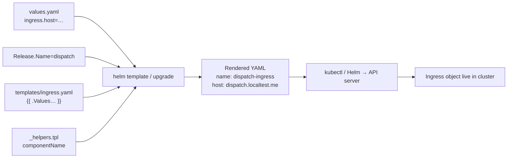

| Layer | Example |
|-------|---------|
| Template says | `name: {{ include "dispatch.componentName" … "api" }}` |
| Helper computes | `dispatch` + `-` + `api` → `dispatch-api` |
| Values say | `api.service.port: 4000` |
| Cluster gets | Service/Ingress backend pointing at `dispatch-api:4000` |

Same pattern for every file in `templates/`.

### Reference example (template → values → rendered YAML)

**Command used** (release name `dispatch`, default values + host override):

```bash
helm template dispatch infra/helm/dispatch-platform \
  --set ingress.host=dispatch.localtest.me
```

#### A) API Service — smallest full example

**1. Values** ([`values.yaml`](../infra/helm/dispatch-platform/values.yaml)):

```yaml
api:
  service:
    port: 4000
```

**2. Template** ([`api-service.yaml`](../infra/helm/dispatch-platform/templates/api-service.yaml)):

```yaml
apiVersion: v1
kind: Service
metadata:
  name: {{ include "dispatch.componentName" (dict "root" . "name" "api") }}
  labels:
    {{- include "dispatch.commonLabels" (dict "root" . "name" "api" "component" "backend") | nindent 4 }}
spec:
  type: ClusterIP
  selector:
    {{- include "dispatch.selectorLabels" (dict "root" . "name" "api") | nindent 4 }}
  ports:
    - name: http
      port: {{ .Values.api.service.port }}
      targetPort: http
```

**3. Rendered output** (what Kubernetes actually gets):

```yaml
# Source: dispatch-platform/templates/api-service.yaml
apiVersion: v1
kind: Service
metadata:
  name: dispatch-api
  labels:
    app.kubernetes.io/name: api
    app.kubernetes.io/instance: dispatch
    app.kubernetes.io/part-of: dispatch-platform
    app.kubernetes.io/component: backend
    app.kubernetes.io/managed-by: Helm
spec:
  type: ClusterIP
  selector:
    app.kubernetes.io/name: api
    app.kubernetes.io/instance: dispatch
  ports:
    - name: http
      port: 4000
      targetPort: http
```

| Hole in template | Filled with |
|------------------|-------------|
| `dispatch.componentName` … `"api"` | `dispatch-api` (release `dispatch` + component) |
| `dispatch.commonLabels` / `selectorLabels` | standard label block |
| `.Values.api.service.port` | `4000` |

#### B) Ingress — same ideas, more fields

**1. Values** (defaults + bootstrap `--set`):

```yaml
ingress:
  enabled: true
  className: nginx
  host: dispatch.localtest.me          # --set ingress.host=…
  tls:
    secretName: dispatch-local-tls     # --set ingress.tls.secretName=…
  annotations:
    nginx.ingress.kubernetes.io/proxy-buffering: "off"
    # …
api:
  service:
    port: 4000
web:
  service:
    port: 80
```

**2. Template** (abbreviated — full file [`ingress.yaml`](../infra/helm/dispatch-platform/templates/ingress.yaml)):

```yaml
metadata:
  name: {{ include "dispatch.componentName" (dict "root" . "name" "ingress") }}
spec:
  ingressClassName: {{ .Values.ingress.className }}
  rules:
    - host: {{ .Values.ingress.host }}
      http:
        paths:
          - path: /api
            backend:
              service:
                name: {{ include "dispatch.componentName" (dict "root" . "name" "api") }}
                port:
                  number: {{ .Values.api.service.port }}
          - path: /
            backend:
              service:
                name: {{ include "dispatch.componentName" (dict "root" . "name" "web") }}
                port:
                  number: {{ .Values.web.service.port }}
```

**3. Rendered output** (key parts):

```yaml
# Source: dispatch-platform/templates/ingress.yaml
apiVersion: networking.k8s.io/v1
kind: Ingress
metadata:
  name: dispatch-ingress
  labels:
    app.kubernetes.io/name: ingress
    app.kubernetes.io/instance: dispatch
    app.kubernetes.io/part-of: dispatch-platform
    app.kubernetes.io/component: proxy
    app.kubernetes.io/managed-by: Helm
  annotations:
    nginx.ingress.kubernetes.io/proxy-buffering: "off"
    nginx.ingress.kubernetes.io/proxy-read-timeout: "86400"
    nginx.ingress.kubernetes.io/proxy-send-timeout: "86400"
spec:
  ingressClassName: nginx
  tls:
    - hosts:
        - dispatch.localtest.me
      secretName: dispatch-local-tls
  rules:
    - host: dispatch.localtest.me
      http:
        paths:
          - path: /api
            pathType: Prefix
            backend:
              service:
                name: dispatch-api      # must match rendered Service above
                port:
                  number: 4000
          - path: /
            pathType: Prefix
            backend:
              service:
                name: dispatch-web
                port:
                  number: 80
```

**Why this matters:** the Ingress backend `name: dispatch-api` is **the same string** the Service got from the same helper — that is the naming convention paying off.

See only Ingress in the render:

```bash
helm template dispatch infra/helm/dispatch-platform \
  --set ingress.host=dispatch.localtest.me \
  --show-only templates/ingress.yaml
```

### Two charts, two releases (how bootstrap uses them)

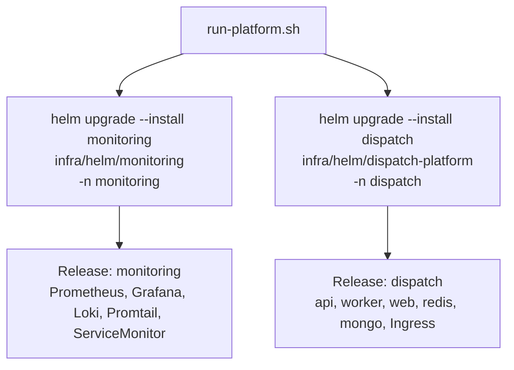

| Release name | Chart path | Namespace | Installs |
|--------------|------------|-----------|----------|
| `dispatch` | `infra/helm/dispatch-platform` | `dispatch` | App + datastores + Ingress |
| `monitoring` | `infra/helm/monitoring` | `monitoring` | Observability stack |

Commands in [`run-platform.sh`](../run-platform.sh): `cmd_deps` (monitoring) · `cmd_deploy` (app, with `--set ingress.host=…`).

### Umbrella chart (monitoring) vs app chart

| | **dispatch-platform** | **monitoring** |
|--|-------------------|----------------|
| Style | We wrote the templates | We mostly **depend on** upstream charts |
| Dependencies | none | kube-prometheus-stack, loki, promtail in `Chart.yaml` |
| `helm dependency build` | not needed | downloads `.tgz` into `charts/` (lockfile committed) |
| Our custom YAML | many templates | mainly `api-servicemonitor.yaml` + values overrides |

```text
monitoring Chart.yaml
        │
        ├── dependency: kube-prometheus-stack  →  Grafana, Prometheus, operator, …
        ├── dependency: loki
        ├── dependency: promtail
        └── templates/api-servicemonitor.yaml  →  our scrape config for dispatch-api
```

### Useful Helm commands (local)

| Command | Purpose |
|---------|---------|
| `helm template dispatch infra/helm/dispatch-platform` | Render YAML to stdout (debug) |
| `helm lint infra/helm/dispatch-platform` | Chart sanity check (also in CI) |
| `helm list -A` | See releases |
| `helm get values dispatch -n dispatch` | What values the live release used |
| `helm get manifest dispatch -n dispatch` | Exact YAML currently applied |
| `helm upgrade --install …` | Install or update |

### How it fits the rest of the platform

```text
Dockerfiles  →  images (dispatch-api:local, …)
kind         →  empty cluster
Helm         →  “install the app shape” (Deployments, Services, Ingress, …)
Ingress      →  public HTTPS routes into that shape
pytest       →  asserts the live objects + HTTP through Ingress
```

Helm does **not** build images or create the kind cluster — bootstrap does those first, then Helm wires the Kubernetes objects that *use* the images.

---

## 1. Big picture — what runs where

> **kind** runs a local K8s cluster; **Helm** installs the app + monitoring; **ingress-nginx** is the only public entry (plus Grafana’s host).  
> Bootstrap (`make bootstrap` → kind + helm + pytest) is a separate lifecycle — see §7 — not drawn as an edge into this runtime diagram (Mermaid cannot attach cleanly to a subgraph).

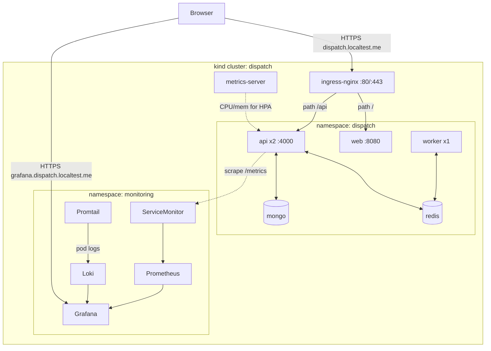

**Sources**

| Piece | Path |
|-------|------|
| kind topology | [`infra/kind/kind-cluster.yaml`](../infra/kind/kind-cluster.yaml) |
| app chart | [`infra/helm/dispatch-platform/`](../infra/helm/dispatch-platform/) |
| monitoring chart | [`infra/helm/monitoring/`](../infra/helm/monitoring/) |
| bootstrap | [`run-platform.sh`](../run-platform.sh) · [`Makefile`](../Makefile) |

---

## 2. Traffic through Ingress

> **Ingress** = the cluster’s public front door (host + path routing).

### TLS termination (what that phrase means)

**TLS** = the encryption layer behind HTTPS (the lock in the browser).

**Termination** = the Ingress controller is where encryption **stops**:

```text
Browser  ──HTTPS (encrypted)──▶  Ingress (decrypts here)
                                      │
                                      ├── HTTP inside cluster ──▶ web pods
                                      └── HTTP inside cluster ──▶ api pods
```

| Step | What happens |
|------|----------------|
| 1 | You open `https://dispatch.localtest.me` — browser encrypts the request |
| 2 | **ingress-nginx** presents the TLS cert (Secret) and **decrypts** the traffic |
| 3 | From Ingress → pods, traffic is plain HTTP on the cluster network (normal for local kind) |
| 4 | Ingress looks at the **path** and forwards to the right Service |

So “terminates TLS” does **not** mean “turns HTTPS off for users.” It means: **users still use HTTPS; the lock ends at the front door**, and pods don’t each need their own certificates.

Sources: [`ingress.yaml`](../infra/helm/dispatch-platform/templates/ingress.yaml) (`tls:` + paths) · cert Secret created in [`run-platform.sh`](../run-platform.sh) `ensure_tls_secret`.

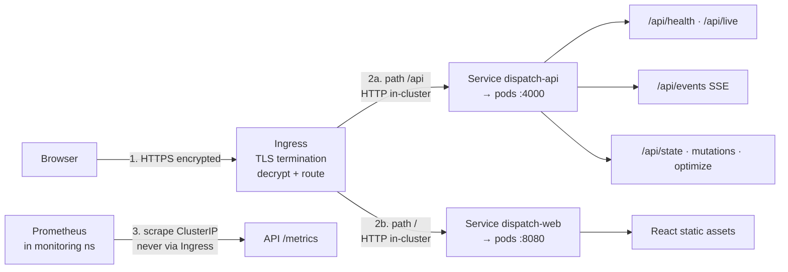

| Public URL (via Ingress) | Goes to | Source |
|--------------------------|---------|--------|
| `https://dispatch.localtest.me/` | web SPA | [`ingress.yaml`](../infra/helm/dispatch-platform/templates/ingress.yaml) path `/` |
| `https://dispatch.localtest.me/api/...` | API | same, path `/api` |
| `https://grafana.dispatch.localtest.me` | Grafana | separate Ingress host |

### Ingress.yaml — naming conventions & where values come from

Helm templates are not plain YAML: `{{ ... }}` is filled in at `helm upgrade --install`.  
File: [`infra/helm/dispatch-platform/templates/ingress.yaml`](../infra/helm/dispatch-platform/templates/ingress.yaml).

#### Helm syntax cheat-sheet (this file)

| In the template | Meaning |
|-----------------|---------|
| `.Values.*` | From chart defaults [`values.yaml`](../infra/helm/dispatch-platform/values.yaml), optionally overridden by `--set` / `-f` |
| `.Release.Name` | Helm release name (`dispatch` when we install as release `dispatch`) |
| `include "dispatch.componentName" …` | Shared helper in [`_helpers.tpl`](../infra/helm/dispatch-platform/templates/_helpers.tpl) |
| `include "dispatch.commonLabels" …` | Same — standard Kubernetes labels |
| `toYaml` / `nindent` | Dump a map as YAML with correct indentation |

#### Resource naming convention

```13:15:infra/helm/dispatch-platform/templates/_helpers.tpl
{{- define "dispatch.componentName" -}}
{{- printf "%s-%s" (include "dispatch.fullname" .root) .name | trunc 63 | trimSuffix "-" -}}
{{- end -}}
```

| Pattern | Example (release `dispatch`) | Used in Ingress for |
|---------|--------------------------|---------------------|
| `{release}-{component}` | `dispatch-ingress` | Ingress object `metadata.name` |
| same | `dispatch-api` | backend Service for `/api` |
| same | `dispatch-web` | backend Service for `/` |

`dispatch.fullname` defaults to `.Release.Name` (or `fullnameOverride` if set). Policy: [`docs/conventions.md`](conventions.md).

#### Why this convention? What does it solve?

Without helpers, every template would hardcode names like `dispatch-api` in many places. That breaks the moment the release name changes, and it’s easy for Ingress to point at `api` while the Service is named `dispatch-api` (typo / drift).

| Problem without a convention | What `{release}-{component}` + helpers fix |
|------------------------------|--------------------------------------------|
| **Name collisions** | Two Helm installs in one cluster need distinct object names. Prefixing with the release (`dispatch-…` vs `staging-…`) keeps them apart. |
| **Wire-up drift** | Ingress must target the **exact** Service name. One helper means Ingress, Deployment, Service, HPA, ConfigMap all invent the **same** string. |
| **Copy-paste bugs** | Rename once in `_helpers.tpl` / release name — not in 15 YAML files. |
| **Ops discoverability** | `kubectl get all` shows `dispatch-api`, `dispatch-web`, … — you can tell which app/release owns what. |
| **Label queries** | Standard labels (`app.kubernetes.io/name=api`, `instance=dispatch`) power selectors, HPA targets, ServiceMonitor, and tests (`kubectl -l …`, pytest). |
| **Helm ecosystem norm** | Same pattern as most charts: release-scoped names + recommended Kubernetes labels. |

In short: **one source of truth for “what is this object called?”** so routing, scaling, scraping, and tests all agree.

**Output example** (what Helm actually prints after render):

```text
Inputs (bootstrap defaults)
  .Release.Name          = dispatch
  .Values.fullnameOverride = ""          (empty → use Release.Name)
  .Values.nameOverride   = ""

Step 1 — dispatch.fullname
  → "dispatch"

Step 2 — dispatch.componentName with name=…
  include "dispatch.componentName" (dict "root" . "name" "ingress")  →  dispatch-ingress
  include "dispatch.componentName" (dict "root" . "name" "api")      →  dispatch-api
  include "dispatch.componentName" (dict "root" . "name" "web")      →  dispatch-web
  include "dispatch.componentName" (dict "root" . "name" "redis")    →  dispatch-redis
```

Rendered Ingress snippet (names only — same install):

```yaml
metadata:
  name: dispatch-ingress          # was: {{ include "dispatch.componentName" … "ingress" }}
spec:
  rules:
    - http:
        paths:
          - path: /api
            backend:
              service:
                name: dispatch-api   # was: … "api"
          - path: /
            backend:
              service:
                name: dispatch-web   # was: … "web"
```

If you ever set `fullnameOverride: myapp` in values, the same helpers would emit `myapp-ingress`, `myapp-api`, `myapp-web` instead.

#### Labels convention

```22:27:infra/helm/dispatch-platform/templates/_helpers.tpl
{{- define "dispatch.commonLabels" -}}
{{ include "dispatch.selectorLabels" . }}
app.kubernetes.io/part-of: dispatch-platform
app.kubernetes.io/component: {{ .component }}
app.kubernetes.io/managed-by: {{ .root.Release.Service }}
{{- end -}}
```

For this Ingress: `name=ingress`, `component=proxy` → labels include `app.kubernetes.io/name: ingress`, `app.kubernetes.io/instance: dispatch`, `app.kubernetes.io/component: proxy`.

#### Line-by-line: template → value source

| Template expression | Resolves to (defaults) | Imported from |
|---------------------|------------------------|---------------|
| `.Values.ingress.enabled` | `true` | [`values.yaml`](../infra/helm/dispatch-platform/values.yaml) `ingress.enabled` — wraps whole file in `if` |
| `dispatch.componentName` … `"ingress"` | `dispatch-ingress` | helper + `.Release.Name` |
| `dispatch.commonLabels` … `"ingress"` / `"proxy"` | standard label set | [`_helpers.tpl`](../infra/helm/dispatch-platform/templates/_helpers.tpl) |
| `.Values.ingress.annotations` | SSE-safe nginx annotations | [`values.yaml`](../infra/helm/dispatch-platform/values.yaml) `ingress.annotations` |
| `.Values.ingress.className` | `nginx` | `values.yaml` → matches ingress-nginx controller |
| `.Values.ingress.host` | `dispatch.localtest.me` | `values.yaml`; **overridden at deploy** by `--set ingress.host=…` |
| `.Values.ingress.tls.secretName` | `dispatch-local-tls` | `values.yaml`; **overridden** by `--set ingress.tls.secretName=…` |
| `dispatch.componentName` … `"api"` | `dispatch-api` | must match [`api-service.yaml`](../infra/helm/dispatch-platform/templates/api-service.yaml) name |
| `.Values.api.service.port` | `4000` | [`values.yaml`](../infra/helm/dispatch-platform/values.yaml) `api.service.port` |
| `dispatch.componentName` … `"web"` | `dispatch-web` | must match [`web-service.yaml`](../infra/helm/dispatch-platform/templates/web-service.yaml) name |
| `.Values.web.service.port` | `80` | [`values.yaml`](../infra/helm/dispatch-platform/values.yaml) `web.service.port` (Service port → pods :8080) |

#### Who overrides host / TLS at install time

Bootstrap does not edit the template; it passes flags:

```448:452:run-platform.sh
  helm upgrade --install "$RELEASE_NAME" "$CHART_DIR" \
    --namespace "$K8S_NAMESPACE" \
    --create-namespace \
    --set ingress.host="$INGRESS_HOST" \
    --set ingress.tls.secretName="$TLS_SECRET_NAME"
```

| Flag / env | Default | Creates / must match |
|------------|---------|----------------------|
| `INGRESS_HOST` | `dispatch.localtest.me` | Ingress `host` + TLS SAN |
| `TLS_SECRET_NAME` | `dispatch-local-tls` | Secret from `ensure_tls_secret` in [`run-platform.sh`](../run-platform.sh) |

Defaults live in [`values.yaml`](../infra/helm/dispatch-platform/values.yaml):

```6:17:infra/helm/dispatch-platform/values.yaml
ingress:
  enabled: true
  className: nginx
  host: dispatch.localtest.me
  tls:
    secretName: dispatch-local-tls
  # SSE needs buffering off + a long read timeout. Only /api is routed to the
  # API service, so /metrics (served at the API root) is never reachable here.
  annotations:
    nginx.ingress.kubernetes.io/proxy-buffering: "off"
    nginx.ingress.kubernetes.io/proxy-read-timeout: "86400"
    nginx.ingress.kubernetes.io/proxy-send-timeout: "86400"
```

### What “`/metrics` is not an Ingress path” means

Two different things get confused here:

| Thing | Meaning |
|-------|---------|
| **API has a `/metrics` route** | Yes — the Bun process answers `GET /metrics`. The endpoint **exists on the pod**. |
| **Ingress path for `/metrics`** | No — Ingress only lists `/` and `/api`. There is **no rule** that sends `/metrics` to the API. |

So:

```text
Browser → https://dispatch.localtest.me/api/health     ✅ Ingress rule /api → API
Browser → https://dispatch.localtest.me/metrics        ❌ No Ingress rule for /metrics
                                                    → falls through to web (/) → SPA HTML, not Prometheus text

Prometheus (inside cluster) → http://dispatch-api.dispatch.svc:4000/metrics   ✅
                              uses the Service (ClusterIP), never the public URL
```

| Word | Plain meaning |
|------|----------------|
| **ClusterIP** | The `dispatch-api` Service has a virtual IP **only reachable from other pods** in the cluster. Your laptop’s browser cannot use that IP. |
| **Scrape** | Prometheus periodically does an HTTP GET on that in-cluster URL and stores the numbers. |

Analogy: the API building has a **back staff door** (`/metrics`) and a **public lobby** (Ingress `/` + `/api`). Prometheus is staff and uses the back door. Guests never get a lobby sign that says `/metrics`.

#### How the code makes this possible (4 pieces)

**1 — API exposes `/metrics` on the process (not under `/api`)**

```49:51:apps/api/src/server.ts
  //   Internal-only endpoint — outside /api/* so nginx never proxies it.
  //   Only reachable within the Docker network by Prometheus.
  app.get("/metrics", metricsHandler);
```

Handler that returns Prometheus text: [`metrics.ts`](../apps/api/src/interface/middleware/metrics.ts) → `metricsHandler`.

**2 — Ingress public menu has only `/api` and `/` (no `/metrics`)**

```20:33:infra/helm/dispatch-platform/templates/ingress.yaml
          - path: /api
            pathType: Prefix
            backend:
              service:
                name: {{ include "dispatch.componentName" (dict "root" . "name" "api") }}
                port:
                  number: {{ .Values.api.service.port }}
          - path: /
            pathType: Prefix
            backend:
              service:
                name: {{ include "dispatch.componentName" (dict "root" . "name" "web") }}
                port:
                  number: {{ .Values.web.service.port }}
```

Because `/` is a prefix, a browser hit to `/metrics` matches **web**, not the API — so you get the SPA, not metrics.

**3 — API Service is ClusterIP (in-cluster only)**

```7:14:infra/helm/dispatch-platform/templates/api-service.yaml
spec:
  type: ClusterIP
  selector:
    {{- include "dispatch.selectorLabels" (dict "root" . "name" "api") | nindent 4 }}
  ports:
    - name: http
      port: {{ .Values.api.service.port }}
      targetPort: http
```

Prometheus (another pod) can call `http://dispatch-api.dispatch.svc:<port>/metrics`. The public internet cannot.

**4 — Prometheus is told to scrape that internal path**

```20:24:infra/helm/monitoring/templates/api-servicemonitor.yaml
  endpoints:
    - port: http
      path: /metrics
      interval: {{ .Values.serviceMonitor.interval }}
      scrapeTimeout: {{ .Values.serviceMonitor.scrapeTimeout }}
```

**Proof in tests** — public URL must not look like Prometheus:

```205:210:tests/infra/test_smoke_e2e.py
def test_metrics_are_not_exposed_through_ingress(http: requests.Session, base_url: str) -> None:
    # Only /api is routed to the API; /metrics falls through to the web SPA and
    # must never return Prometheus exposition data through the public Ingress.
    body = _get(http, base_url, "/metrics").text
    assert "http_request_duration_ms" not in body
    assert not body.lstrip().startswith("# HELP")
```

| Try this | Expect |
|----------|--------|
| `curl -sk https://dispatch.localtest.me/metrics` | Web HTML (or SPA) — **not** `# HELP http_request_duration_ms …` |
| Prometheus scrape via ServiceMonitor | Real metrics text from the API Service |

| They’d see if it *were* public | Risk |
|--------------------------------|------|
| Runtime stats (CPU, memory, GC, …) | Capacity / health of the process |
| HTTP histograms (method, route, status, latency) | Full API surface map + error rates |
| `dispatch_dependency_*` gauges | When Redis/Mongo are unhealthy |
| Continuous public scrapes | Extra load / noise |

SSE-safe Ingress annotations (proxy buffering off, long timeouts): [`dispatch-platform/values.yaml`](../infra/helm/dispatch-platform/values.yaml) → `ingress.annotations`.

---

## 3. Workloads & scaling

> **Deployment** = replaceable replicas. **StatefulSet** = stable identity for datastores. **HPA** watches CPU/memory (via **metrics-server**) and scales the API Deployment between min/max.

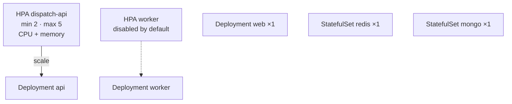

| Component | Kind | Default replicas | HPA | Image build |
|-----------|------|------------------|-----|-------------|
| api | Deployment | 2 | on | [`apps/api/Dockerfile`](../apps/api/Dockerfile) |
| worker | Deployment | 1 | off | [`apps/api/Dockerfile.worker`](../apps/api/Dockerfile.worker) |
| web | Deployment | 1 | — | [`apps/web/Dockerfile`](../apps/web/Dockerfile) |
| redis | StatefulSet | 1 | — | bitnami/redis (chart values) |
| mongo | StatefulSet | 1 | — | bitnami/mongodb (chart values) |

Knobs: [`infra/helm/dispatch-platform/values.yaml`](../infra/helm/dispatch-platform/values.yaml) · helpers: [`_helpers.tpl`](../infra/helm/dispatch-platform/templates/_helpers.tpl) (`containerSecurity`, labels).

---

## 4. Probe contract (readiness ≠ liveness)

> Kubelet health checks: **liveness** = “process dead? restart it.” **readiness** = “can it serve traffic *right now*?” We split them so a Redis blip takes the pod out of rotation (**503**) without a restart storm.

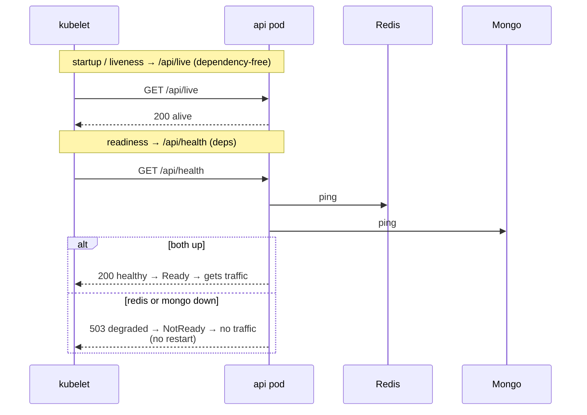

| Probe | Path | On failure | Why |
|-------|------|------------|-----|
| **startup** | `/api/live` | delay Ready | boot / hydration window |
| **liveness** | `/api/live` | restart pod | process dead — not “deps down” |
| **readiness** | `/api/health` | remove from Endpoints | deps down — don’t kill pod |

| Layer | Source |
|-------|--------|
| Helm probes | [`api-deployment.yaml`](../infra/helm/dispatch-platform/templates/api-deployment.yaml) |
| Handlers | [`health.controller.ts`](../apps/api/src/interface/controllers/health.controller.ts) |
| Routes | [`health.routes.ts`](../apps/api/src/interface/routes/health.routes.ts) → mounted at `/api` in [`server.ts`](../apps/api/src/server.ts) |
| Asserted | [`test_cluster_state.py`](../tests/infra/test_cluster_state.py) · [`test_zz_probe_resilience.py`](../tests/infra/test_zz_probe_resilience.py) |

Also updates Prometheus gauges `dispatch_dependency_up` / `dispatch_dependency_latency_ms` via [`metrics.ts`](../apps/api/src/interface/middleware/metrics.ts) `recordDependencyHealth`.

---

## 5. Data & async flows (platform view)

> **Redis** = hot state + queues. **Mongo** = durable snapshots. **Streams** move optimize work API ⇄ worker. **SSE** pushes live updates to browsers; with multiple API pods, **Pub/Sub `sse:live`** fans out so every replica can write to its connected clients.

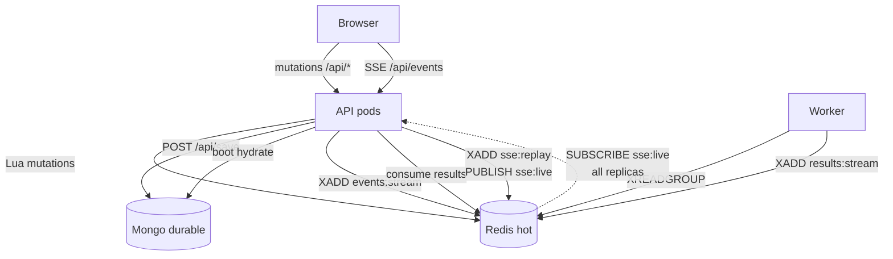

| Stream / channel | Purpose | Source |
|------------------|---------|--------|
| `events:stream` | optimize jobs → worker | [`redis-keys.ts`](../apps/api/src/config/redis-keys.ts) |
| `results:stream` | worker → API consumer | same |
| `sse:replay` | Last-Event-ID replay buffer | same · [`sse-gateway.ts`](../apps/api/src/infrastructure/sse/sse-gateway.ts) |
| `sse:live` | Pub/Sub fan-out across **api replicas** | same |

> Notation: with `api.replicaCount ≥ 2`, in-memory SSE alone is wrong — mutation on pod B must reach clients on pod A → **XADD + PUBLISH**.

---

## 6. Observability pipeline

> **Prometheus** scrapes numbers; **Loki** stores logs (via **Promtail**); **Grafana** is the UI. **ServiceMonitor** is how the Prometheus Operator discovers our API `/metrics` without publishing it on Ingress.

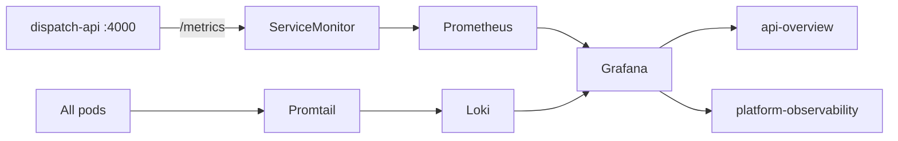

| Concern | Component | In-cluster source |
|---------|-----------|-------------------|
| Metrics scrape | ServiceMonitor → Prometheus | [`api-servicemonitor.yaml`](../infra/helm/monitoring/templates/api-servicemonitor.yaml) |
| Metrics export | `GET /metrics` | [`metrics.ts`](../apps/api/src/interface/middleware/metrics.ts) |
| Logs | Promtail → Loki | [`monitoring/values.yaml`](../infra/helm/monitoring/values.yaml) (promtail config) |
| Datasources (K8s) | ConfigMap sidecar | [`packages/monitoring/grafana/k8s/datasources.yaml`](../packages/monitoring/grafana/k8s/datasources.yaml) |
| Dashboards | ConfigMaps | [`provisioning/dashboards/*.json`](../packages/monitoring/grafana/provisioning/dashboards/) |
| Apply step | bootstrap | `apply_monitoring_grafana_assets` in [`run-platform.sh`](../run-platform.sh) |

| Env | Datasource file | Why split |
|-----|-----------------|-----------|
| K8s | `grafana/k8s/datasources.yaml` | cluster DNS (`monitoring-kube-prometheus-prometheus` …) |
| Compose | `grafana/provisioning/datasources/datasources.yml` | compose service names |

Creds (local, gitignored): `.tmp/k8s/grafana-admin.env` ← `ensure_grafana_admin_secret` in [`run-platform.sh`](../run-platform.sh).

---

## 7. Bootstrap lifecycle

> One script (`run-platform.sh`) = create **kind** cluster → install add-ons (**metrics-server**, **ingress-nginx**, monitoring Helm) → build/load images → **Helm** deploy app → **pytest** smoke. Goal: **green**.

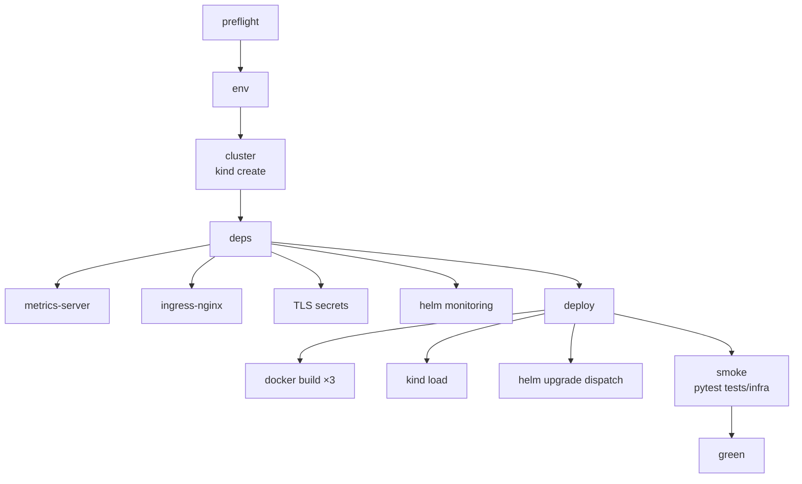

| Command | Does | Entry |
|---------|------|-------|
| `make bootstrap` / `./run-platform.sh up` | full path above | [`run-platform.sh`](../run-platform.sh) `cmd_up` |
| `deps` | cluster add-ons + monitoring | `cmd_deps` |
| `deploy` | images + app Helm | `cmd_deploy` |
| `smoke` | wait `/api/health` → pytest | `cmd_smoke` |
| `down` | uninstall + `kind delete` | `cmd_down` |

Compose fallback (not submission default): `make compose-up` / `compose-*` commands in the same script.

---

## 8. CI/CD

> **GitHub Actions**: PRs run quality gates (typecheck, tests, **hadolint**, Helm/**kubeconform**). Merges to `main` also **build & push** images to **GHCR** tagged by git SHA (immutable; K8s never uses `:latest` as the install reference).

### What is GHCR?

| | |
|--|--|
| **Full name** | GitHub Container Registry |
| **URL prefix** | `ghcr.io/<owner>/<image>:<tag>` |
| **Job here** | After CI builds Docker images, it **pushes** them to GHCR so a cluster (or another machine) can `docker pull` / `image: ghcr.io/…` without rebuilding locally |
| **Tags we care about** | Immutable **git SHA** (e.g. `abc1234`) — pin exact code. `:latest` may exist as a convenience on `main` but K8s manifests should not rely on it |
| **Local vs CI** | Laptop bootstrap: `dispatch-api:local` + `kind load`. CI / registry installs: `ghcr.io/…/dispatch-api:<sha>` via [`values-ci.yaml`](../infra/helm/dispatch-platform/values-ci.yaml) |

```text
Dockerfile ──▶ docker build ──▶ image
                                  │
              local path          │          CI path
         kind load dispatch-api:local │    push ghcr.io/owner/dispatch-api:<sha>
                                  ▼
                         Helm values → Deployment image:
```

Workflow: [`.github/workflows/build.yml`](../.github/workflows/build.yml). Policy: [`conventions.md`](conventions.md) (Images).

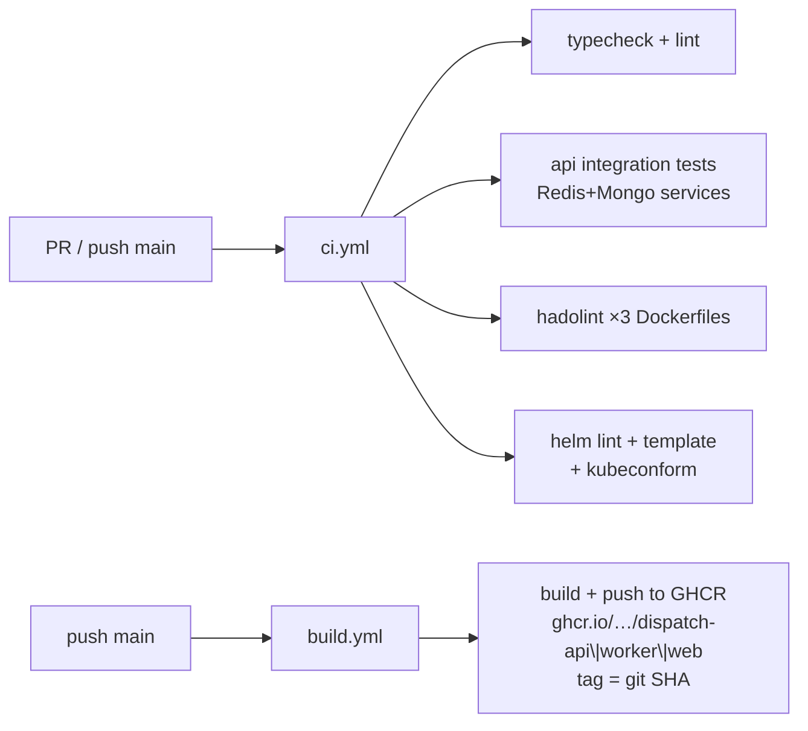

| Workflow | Path | Gates / output |
|----------|------|----------------|
| CI | [`.github/workflows/ci.yml`](../.github/workflows/ci.yml) | typecheck, lint, tests, hadolint, chart validate |
| Build | [`.github/workflows/build.yml`](../.github/workflows/build.yml) | Push images to **GHCR** (`ghcr.io`) by git SHA |
| CI chart overlay | [`values-ci.yaml`](../infra/helm/dispatch-platform/values-ci.yaml) | `repository: ghcr.io/…` + `imagePullPolicy: Always` |

---

## 9. Infra test map

> **pytest** + Kubernetes Python client: assert cluster objects via the API, and real HTTPS flows through Ingress (not `kubectl port-forward`). Proves the platform, not product features.

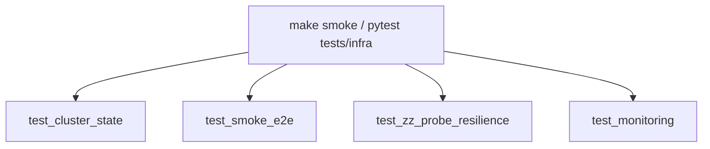

| File | Asserts (one line) | How |
|------|--------------------|-----|
| [`test_cluster_state.py`](../tests/infra/test_cluster_state.py) | Ready workloads, labels, probe split, requests/limits, Config≠Secret, HPA, Ingress TLS+paths | k8s API |
| [`test_smoke_e2e.py`](../tests/infra/test_smoke_e2e.py) | HTTPS UI, health, hydrate, assign, optimize, SSE, `/metrics` not public | HTTPS Ingress |
| [`test_zz_probe_resilience.py`](../tests/infra/test_zz_probe_resilience.py) | Kill Redis → readiness flips; API not restarted; full recovery (runs last) | k8s API + Ingress |
| [`test_monitoring.py`](../tests/infra/test_monitoring.py) | Stack Ready, ServiceMonitor, Grafana login, scrape `up`, dashboard CMs | k8s API + Grafana HTTPS |

Fixtures: [`conftest.py`](../tests/infra/conftest.py) · deps: [`requirements.txt`](../tests/infra/requirements.txt).

---

## 10. Config vs Secret (app)

> **ConfigMap** = non-secret settings (hosts, ports, CORS). **Secret** = passwords/credentials. Both injected as env; Pillar C tests fail if a secret key leaks into the ConfigMap.

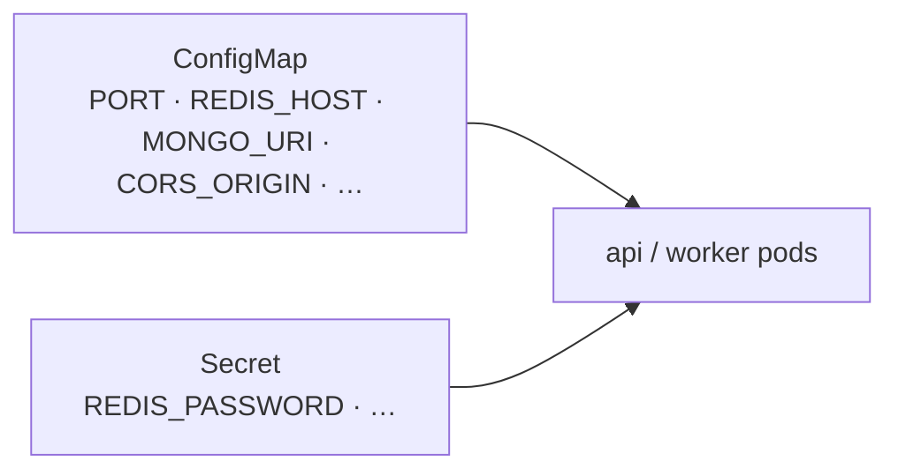

| Goes in | Examples | Source |
|---------|----------|--------|
| ConfigMap | hosts, ports, CORS, rate limits | [`configmap.yaml`](../infra/helm/dispatch-platform/templates/configmap.yaml) |
| Secret | passwords / credentials | [`secret.yaml`](../infra/helm/dispatch-platform/templates/secret.yaml) |
| Env schema | what the process expects | [`apps/api/src/config/env.ts`](../apps/api/src/config/env.ts) |

Policy: [`docs/conventions.md`](conventions.md) · enforced by Pillar C tests.

---

## 11. Module → pillar cheat sheet

| Pillar | Own these | Doc |
|--------|-----------|-----|
| **A** K8s | `infra/kind/` · `infra/helm/dispatch-platform/` · probes · HPA · Ingress | [`02-pillar-a-kubernetes.md`](02-pillar-a-kubernetes.md) |
| **B** CI/CD | `.github/workflows/` · Dockerfiles · chart validate · **GHCR** image push | [`03-pillar-b-cicd.md`](03-pillar-b-cicd.md) |
| **C** Tests | `tests/infra/` | [`04-pillar-c-testing.md`](04-pillar-c-testing.md) |
| **D** Observability | `infra/helm/monitoring/` · `packages/monitoring/` · metrics/health hooks | [`05-pillar-d-observability.md`](05-pillar-d-observability.md) |
| **Deliverables** | `run-platform.sh` · README runbook · comparison matrix | [`06-deliverables-runbook.md`](06-deliverables-runbook.md) |
| **Decisions** | naming, probe split, SSE pub/sub, … | [`conventions.md`](conventions.md) |
| **YAML glossary** | plain-language manifests | [`08-yaml-reference.md`](08-yaml-reference.md) |
| **Issues** | symptom → fix ledger | [`09-build-issues-and-troubleshooting.md`](09-build-issues-and-troubleshooting.md) |

**Do not modify:** `apps/web/src` (frozen UI).

**Minimal API edits allowed for infra:**

| File | Why |
|------|-----|
| [`health.controller.ts`](../apps/api/src/interface/controllers/health.controller.ts) | `/api/live` + readiness `/api/health` |
| [`metrics.ts`](../apps/api/src/interface/middleware/metrics.ts) | `/metrics` + dependency gauges |
| [`sse-gateway.ts`](../apps/api/src/infrastructure/sse/sse-gateway.ts) | multi-replica SSE via `sse:live` |

---

## 12. “Green” checklist (operator)

| Check | Expect |
|-------|--------|
| `kubectl -n dispatch get pods` | all Ready |
| `kubectl -n monitoring get pods` | Grafana / Prometheus / Loki / Promtail Ready |
| `curl -sk https://dispatch.localtest.me/api/health` | `"status":"healthy"` |
| `curl -sk https://grafana.dispatch.localtest.me` | Grafana login HTML |
| `make smoke` | pytest 21 passed |

Teardown: `make down` (kind) · `make compose-down ARGS=-v` (compose only).
