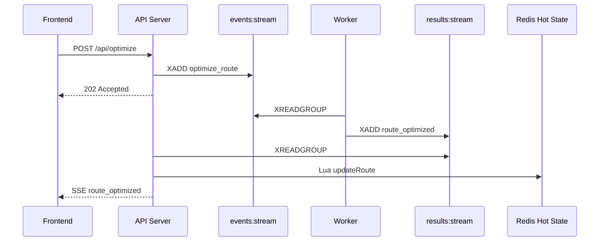
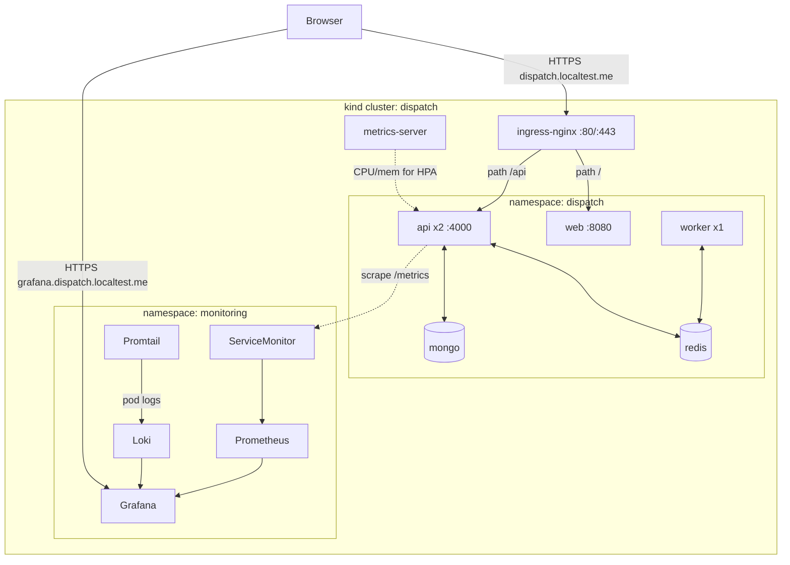
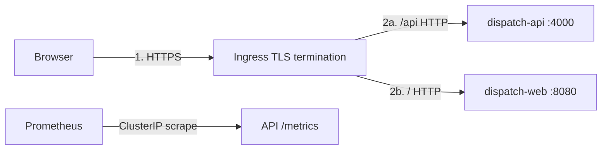
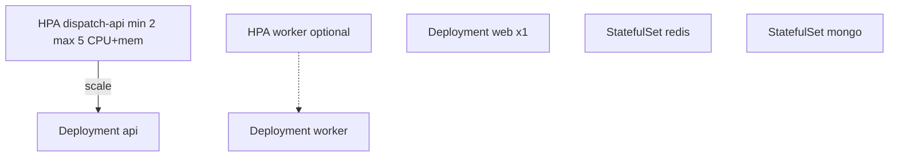
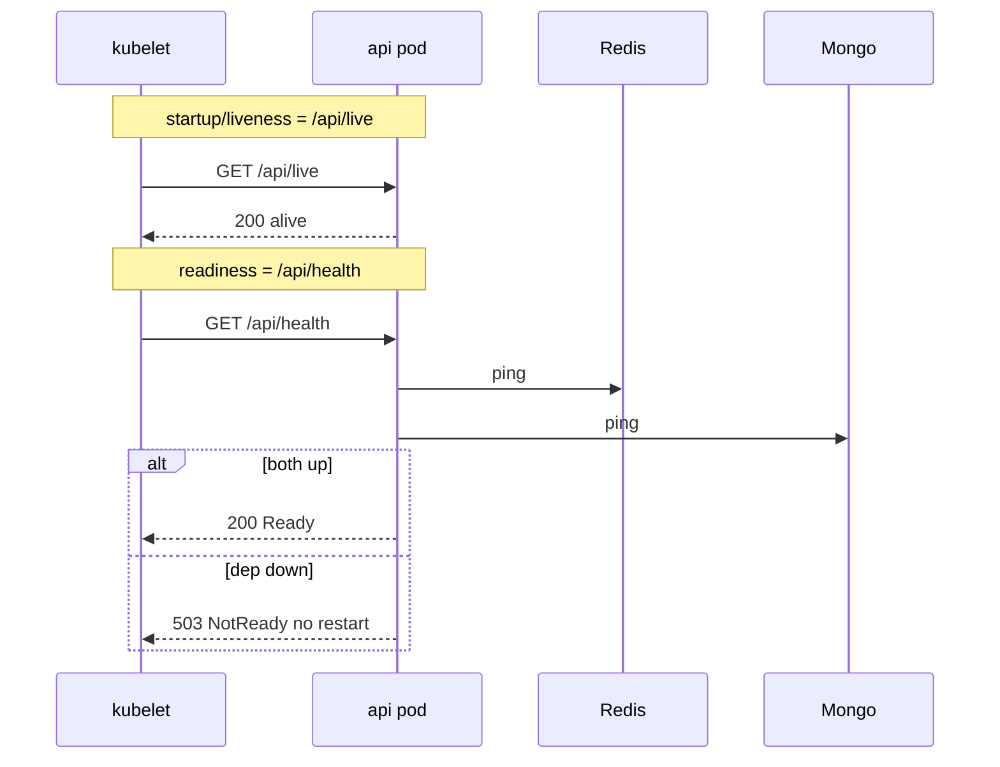
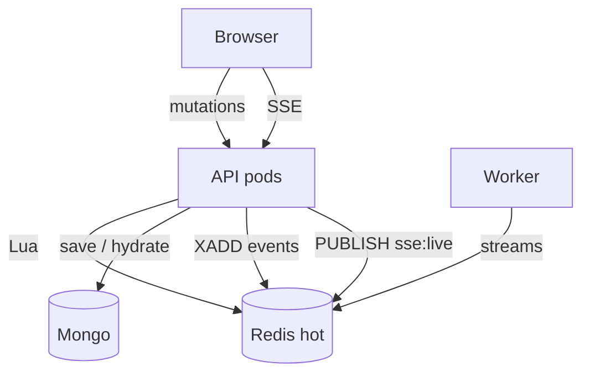
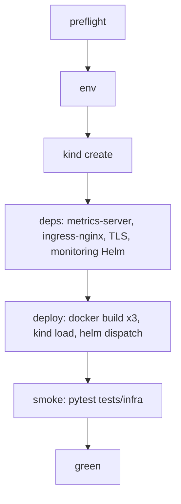
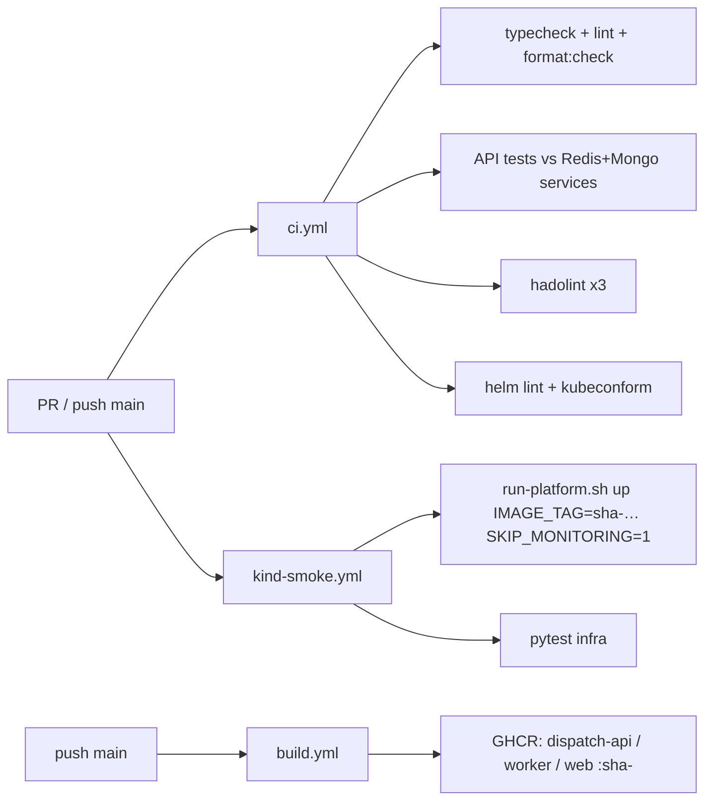
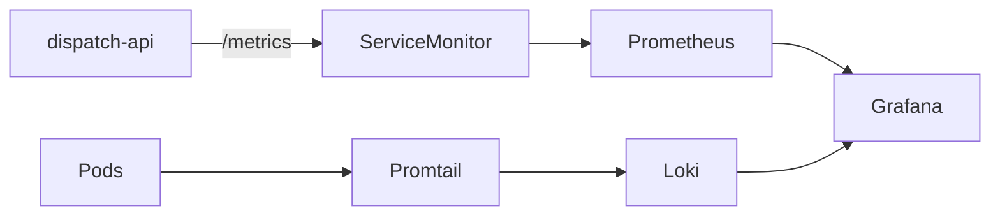

# Dispatch Platform — Full Project Documentation

> **Purpose:** Single feed document for resume / LinkedIn / interview AI. Covers product context,
> frontend, backend, shared types, and the platform engineering work (Kubernetes, CI/CD, tests,
> observability). Diagrams are copied from the platform runbook / architecture docs.
>
> **Repo:** local workspace repository  
> **Role framing:** Senior Platform Engineer take-home — package a real-time logistics dispatch
> baseline into a production-grade **local Kubernetes** platform with CI/CD, infra tests, and
> observability. App UI logic was largely frozen; platform work owned packaging, scale, probes,
> SSE multi-replica fan-out, pipelines, and green-state automation.

---

## 1. One-paragraph summary (paste-ready)

Built and shipped a production-style local Kubernetes platform for a Bun/TypeScript logistics
dispatch monorepo (Express API + worker, React SPA, Redis hot state, MongoDB durable state).
Delivered multi-node kind + Helm (app + monitoring), ingress-nginx with TLS and path-based routing,
HPA/PDB/NetworkPolicy, split readiness/liveness probes, GitHub Actions CI with kind-in-CI smoke and
GHCR SHA-tagged images, pytest cluster/Ingress/monitoring tests, and Prometheus/Grafana/Loki with
provisioned dashboards — all reproducible via one command (`make bootstrap`).

---

## 2. Problem & scope

| Dimension | Detail |
|-----------|--------|
| **Company context** | Dispatch — real-time, event-driven logistics dispatch (Redis Streams + Mongo durable layer) |
| **Challenge** | Senior Platform Engineer take-home (48–72h): K8s topology, CI/CD, infra smoke tests, observability |
| **Given baseline** | Bun monorepo: `apps/api`, `apps/web`, `packages/shared`, Redis, Mongo; Compose starter |
| **Out of scope** | Rewriting the fullstack / modifying frozen React app business logic |
| **In scope** | Package, run, scale, test, observe backend + proxy layers on local multi-node K8s |

### Four pillars delivered

| Pillar | Outcome |
|--------|---------|
| **A — Kubernetes** | kind multi-node, Helm chart, HPA, Ingress (routing + header rewrites + TLS), probes, requests/limits, PDB, anti-affinity, NetworkPolicy |
| **B — CI/CD** | Multi-stage Dockerfiles (non-root, cache-friendly), GitHub Actions gates, GHCR publish, kind-smoke |
| **C — Infra tests** | pytest + k8s client: cluster state, Ingress e2e (HTTP + SSE), probe resilience, monitoring |
| **D — Observability** | kube-prometheus-stack + Loki/Promtail, Grafana ingress, ServiceMonitor, provisioned dashboards |

---

## 3. System topology (application)

```
                 ┌─────────────┐        ┌──────────────┐        ┌──────────────┐
   Ingress  ───▶ │  web (nginx │──/api─▶│  api (Bun/    │──────▶ │   Redis      │
   (nginx)       │  + React)   │        │  Express 5)   │◀─────  │ hot state +  │
                 └─────────────┘        └──────┬───────┘        │ streams      │
                        ▲                       │                └──────┬───────┘
                        │ static SPA            │ durable                │ events/results
                        │                ┌──────▼───────┐         ┌──────▼───────┐
                        └───────────────▶│   MongoDB    │         │  worker (Bun)│
                                         │  (snapshots) │         │  optimizer   │
                                         └──────────────┘         └──────────────┘
```

| Component | Path | Role |
|-----------|------|------|
| **web** | `apps/web` | React SPA; nginx serves static assets; `/api` proxied to API |
| **api** | `apps/api` | Express 5 on Bun; Redis-first mutations; SSE; `/api/health`, `/api/live`, `/metrics` |
| **worker** | `apps/api` (worker entry) | Consumes optimize jobs from Redis Streams; writes results |
| **redis** | StatefulSet | Hot dispatch state + Streams + Pub/Sub (`sse:live`) |
| **mongo** | StatefulSet | Durable snapshots on Save; hydration source on boot |
| **shared** | `packages/shared` | Zod schemas = single source of truth for FE + BE types |

### Hot vs durable state

| | **Hot (Redis)** | **Durable (Mongo)** |
|--|-----------------|---------------------|
| Content | Live plan: vehicles, orders, routes, `rev` | Saved snapshots |
| Speed | Sub-ms Lua mutations | Persistence path |
| Written | Every mutation | Explicit `POST /api/save` |
| Read | Almost every request + SSE | Boot hydration / rehydration if Redis cold |

---

## 4. Frontend (`apps/web`)

**Stack:** React 19 · Vite 7 · TypeScript · TanStack Query v5 · Zustand v5 · React Leaflet · `@repo/shared` Zod types · nginx-unprivileged in production image.

### Architecture

```
┌─────────────────────────────────────────────┐
│                  React App                   │
│  TanStack Query (server state)               │
│  Zustand (UI state)                          │
│  SSE Client (EventSource → cache invalidate) │
│  @repo/shared (Zod types)                    │
└───────────────────┬─────────────────────────┘
                    │ HTTP + SSE
                    ▼
            Express API (apps/api)
```

### State strategy

| Kind | Tool | Examples |
|------|------|----------|
| Server state | TanStack Query | vehicles, orders, assignments, `rev` |
| UI state | Zustand | selection, drawer, optimizing flags, dirty, toasts |
| Realtime | SSE `EventSource` | invalidate `hotState` query on `state_changed` |

### UI surfaces

- **Dispatch board** — drag-and-drop assign/unassign/reassign with capacity checks  
- **Map pane** — Leaflet markers, depots, route polylines  
- **Master data** — vehicle/order CRUD drawer  
- **Toolbar** — optimize, save plan, connection status  

### Mutation UX flow

```
User drag → optimistic TanStack update → POST /api/assign → Lua in Redis
         → SSE broadcast → cache invalidate → authoritative refetch
```

### Packaging note (platform)

Web image is multi-stage: Bun build → `nginxinc/nginx-unprivileged` on **:8080**, non-root, templated nginx config. Served behind Ingress path `/`.

---

## 5. Backend (`apps/api`)

**Stack:** Bun · Express 5 · TypeScript · ioredis + Lua · MongoDB native driver · Redis Streams · SSE · Zod · prom-client · Pino · Helmet / CORS / rate-limit.

### Pattern: Redis-first write-behind + hexagonal ports

```
domain/ports/          → interfaces (IDraftStore, IDurableStore, streams, realtime)
application/services/  → business logic returning Result<T, E>
infrastructure/        → Redis, Mongo, SSE adapters
interface/             → HTTP routes, controllers, middleware
config/container.ts    → composition root (DI wiring)
```

### Key API routes

| Method | Path | Purpose |
|--------|------|---------|
| GET | `/api/live` | Liveness (dependency-free) — K8s liveness/startup |
| GET | `/api/health` | Readiness (Redis + Mongo) — 503 when degraded |
| GET | `/api/state` | Full hot state (pipelined Redis) |
| GET | `/api/events` | SSE stream |
| POST | `/api/assign` | Assign/unassign/reassign (Lua + OCC `baseRev`) |
| POST | `/api/optimize` | Async optimize → `202` + Streams |
| POST | `/api/save` | Persist Redis → Mongo snapshot |
| CRUD | `/api/vehicles`, `/api/orders` | Redis-first mutations |
| GET | `/metrics` | Prometheus exposition (ClusterIP only; not on Ingress) |

### Optimize pipeline (async)



### Multi-replica SSE (platform-relevant change)

With API `replicas ≥ 2`, in-memory SSE sockets are per-pod. After `XADD` to `sse:replay`, the API
**PUBLISH**es on Redis channel `sse:live` so every replica delivers to its local SSE clients.
Replay/history still uses Redis Streams.

### Hydration

Boot: seed Mongo if empty → if Redis cold, lock + copy Mongo snapshot into Redis → ensure stream
consumer groups → start results consumer → listen. Middleware can rehydrate if Redis loses `rev`
mid-flight.

---

## 6. Shared package (`packages/shared`)

Zod schemas for `Vehicle`, `Order`, `Solution`, `Assignment`, API contracts. Types are
`z.infer<typeof Schema>` — one source of truth for API validation and frontend TypeScript.
Bun workspaces (`workspace:*`) wire FE + BE without codegen.

---

## 7. Platform / infrastructure (primary ownership)

### 7.1 Platform topology (kind)



### 7.2 Ingress & TLS



- Host: `dispatch.localtest.me` (app), `grafana.dispatch.localtest.me` (Grafana)
- Header rewrites via ConfigMap + `proxy-set-headers` (`X-Forwarded-Proto` / `Port`)
- SSE: `proxy-buffering=off`, long read timeouts
- Self-signed TLS secrets generated at bootstrap

### 7.3 Workloads & scaling



Also: API **PDB** (`minAvailable: 1`), soft **pod anti-affinity**, **NetworkPolicies**
(Redis/Mongo ← api/worker only; api/web ← Ingress; API ← monitoring scrape).

### 7.4 Probe contract



### 7.5 Data & async flows



### 7.6 Bootstrap lifecycle



**Operator command:** `make bootstrap` ≡ `./run-platform.sh up`  
**Teardown:** `make down`  
**Compose fallback:** `make compose-up` (not submission path)

### 7.7 Helm layout

```
infra/helm/
├── dispatch-platform/     # api, worker, web, redis, mongo, ingress, HPA, PDB, NetworkPolicy
│   ├── values.yaml
│   ├── values-ci.yaml # immutable sha-* tags for CI (no :latest)
│   └── templates/
└── monitoring/        # kube-prometheus-stack + Loki + Promtail + ServiceMonitor
```

### 7.8 Config vs secrets

| Object | Examples |
|--------|----------|
| ConfigMap | `PORT`, `REDIS_HOST`, `MONGO_URI`, `CORS_ORIGIN` |
| Secret | `REDIS_PASSWORD` (never in ConfigMap) |

Injected via `envFrom`. All containers: non-root, drop caps, requests **and** limits.

---

## 8. CI/CD



| Workflow | Trigger | What |
|----------|---------|------|
| `ci.yml` | PR + main | Quality gates + API integration tests |
| `kind-smoke.yml` | PR + main | Full kind deploy + infra pytest (monitoring skipped for runner size) |
| `build.yml` | main | Multi-arch-capable Buildx → GHCR private packages |

Images: `ghcr.io/<owner>/dispatch-{api,worker,web}:sha-<commit>`

Local format: `make format` / git pre-commit hook; CI remains `format:check` only.

---

## 9. Infra tests (`tests/infra`)

| Suite | Asserts |
|-------|---------|
| `test_cluster_state.py` | Deployments/STS Ready, labels, probe split, resources, Config≠Secret, HPA metrics, Ingress TLS/paths/headers, PDB, anti-affinity, NetworkPolicy |
| `test_smoke_e2e.py` | HTTPS root, health, hydration, assign round-trip, optimize rev bump, SSE, `/metrics` not on Ingress |
| `test_zz_probe_resilience.py` | Kill Redis → readiness degrades; API not restarted; multi-sample recovery (runs last) |
| `test_monitoring.py` | Monitoring Ready, ServiceMonitor, Grafana login, Prometheus scrapes `dispatch-api`, provisioning CMs |

Traffic path for smoke: **Ingress HTTPS only** (no app port-forward).

---

## 10. Observability



| Piece | Detail |
|-------|--------|
| Metrics | `http_request_duration_ms`, `dispatch_dependency_up` / `dispatch_dependency_latency_ms` |
| Dashboards | **API Overview**, **Platform Observability** (folder `Dispatch`) |
| Grafana URL | `https://grafana.dispatch.localtest.me` |
| Creds | `.tmp/k8s/grafana-admin.env` |
| Screenshot | `packages/monitoring/grafana/screenshots/grafana-dashboard.png` |

Useful queries: `up{job="dispatch-api"}`, `dispatch_dependency_up`,  
`rate(http_request_duration_ms_count{status_code=~"5.."}[5m])`,  
LogQL `{app="dispatch-api"} | json | level="error"`.

---

## 11. Monorepo layout

```
/
├── apps/api/                 Express API + worker + Lua + SSE
├── apps/web/                 React dispatch UI (frozen app logic)
├── packages/shared/          Zod schemas / types
├── packages/monitoring/      Grafana provisioning + K8s datasources + screenshots
├── infra/kind/               Multi-node kind config
├── infra/helm/dispatch-platform/ App chart
├── infra/helm/monitoring/    Observability umbrella chart
├── tests/infra/              pytest platform suite
├── .github/workflows/        ci, kind-smoke, build
├── run-platform.sh           Bootstrap control script
└── Makefile                  make bootstrap | smoke | down | format | …
```

---

## 12. Tech stacks (split by ownership)

### Platform (owned for this assignment)

kind · Helm · ingress-nginx · Docker / Buildx · GHCR · GitHub Actions · pytest + kubernetes client ·
kube-prometheus-stack · Grafana · Loki · Promtail · metrics-server · NetworkPolicy · HPA · PDB

### Application baseline (understand & package; not feature-built)

Bun · Express 5 · TypeScript · Redis + Lua · MongoDB · Redis Streams · SSE · Zod · React 19 ·
Vite · TanStack Query · Zustand · Leaflet · prom-client · Pino

---

## 13. Resume bullet bank (edit to first person / metrics)

Use these as raw material; tailor numbers if you have them.

**Platform / K8s**
- Designed and automated a multi-node local Kubernetes platform (kind + Helm) for a real-time logistics dispatch stack, bringing cluster, deps, deploy, and smoke tests to green with a single bootstrap command.
- Implemented production patterns: Ingress TLS + path routing, split readiness/liveness probes tied to Redis/Mongo, HPA, PDB, soft anti-affinity, and NetworkPolicies isolating datastores.
- Packaged API, worker, and web with multi-stage Dockerfiles (non-root, no `:latest`), loaded into kind, and published immutable SHA tags to GHCR.

**CI/CD**
- Built GitHub Actions pipelines for typecheck/lint/format, Dockerfile lint (hadolint), Helm/kubeconform validation, API integration tests, kind-in-CI smoke, and GHCR image publish on `main`.

**Reliability / testing**
- Authored pytest + Kubernetes API infra tests covering cluster state, Ingress e2e (including SSE), Redis failure readiness recovery without API restarts, and monitoring scrape/dashboard wiring.

**Observability**
- Deployed Prometheus Operator + Grafana + Loki/Promtail as a separate Helm release; exposed API metrics via ServiceMonitor; provisioned dashboards for request latency, errors, capacity, and dependency health.

**Backend-adjacent platform work**
- Enabled multi-replica API realtime by adding Redis Pub/Sub fan-out for SSE so clients on pod A see mutations handled on pod B.

**Frontend (if claiming familiarity)**
- Documented and packaged a React 19 dispatch UI with TanStack Query + Zustand + SSE sync and end-to-end Zod types from a shared monorepo package (UI feature code frozen per challenge).

---

## 14. Interview talking points

1. **Why split `/api/live` vs `/api/health`?** Avoid restart loops when Redis/Mongo blip; still remove pod from LB when deps are down.  
2. **Why Redis Pub/Sub for SSE?** Sticky sessions don’t help cross-replica push; Streams keep replay, Pub/Sub fans out live frames.  
3. **Why Helm over Kustomize here?** Values-driven toggles; separate monitoring release upgrades independently.  
4. **Why pytest through Ingress?** Proves the real user path (TLS, routing, LB), not a bypassed port-forward.  
5. **Why skip monitoring in kind-smoke CI?** Runner time/resources; full stack verified on local `make bootstrap`.  
6. **ConfigMap vs Secret?** Challenge invariant + twelve-factor; secrets never land in ConfigMap.  
7. **Hot vs durable?** Interactive mutations in Redis; Mongo for save/hydrate — classic write-behind for dispatch UX.

---

## 15. Architecture decision highlights (matrix distilled)

| Choice | Over | Why |
|--------|------|-----|
| kind | minikube | Multi-node YAML, CI reuse |
| Helm (2 charts) | Kustomize / mega-chart | App vs monitoring lifecycle split |
| ingress-nginx | Traefik | kind ubiquity + SSE annotations |
| pytest + k8s client | Terratest / bash | Readable platform assertions |
| GHCR SHA tags | `:latest` | Immutable deploys |
| ServiceMonitor | Public `/metrics` Ingress | Keep scrape private |
| Compose as `compose-*` | Delete entirely | Fallback; K8s remains default |

Full matrix: bottom of [`README.md`](../README.md). Decision log: [`docs/conventions.md`](conventions.md).

---

## 16. Definition of done (verified)

One command on a clean machine → multi-node cluster → deps (incl. monitoring) → app deployed →
pods Ready → smoke green → Grafana live → README runbook + comparison matrix.

Operator checklist completed for submission: private fork, reviewer access, CI green on `main`,
GHCR images published, fresh bootstrap verified.

---

## 17. Key file pointers

| Concern | Path |
|---------|------|
| Bootstrap | `run-platform.sh`, `Makefile` |
| App chart | `infra/helm/dispatch-platform/` |
| Monitoring chart | `infra/helm/monitoring/` |
| kind config | `infra/kind/kind-cluster.yaml` |
| Infra tests | `tests/infra/` |
| CI | `.github/workflows/{ci,kind-smoke,build}.yml` |
| API composition | `apps/api/src/config/container.ts` |
| SSE gateway | `apps/api/src/infrastructure/sse/` |
| Web SSE provider | `apps/web/src/providers/SSEProvider.tsx` |
| Shared schemas | `packages/shared/src/schemas/` |
| Platform runbook | `README.md` |
| Visual architecture deep dive | `docs/10-platform-architecture.md` |

---

*End of resume project documentation. Prefer this file + README architecture section as AI context;
pull `docs/10-platform-architecture.md` only if deeper Helm/probe detail is needed.*
